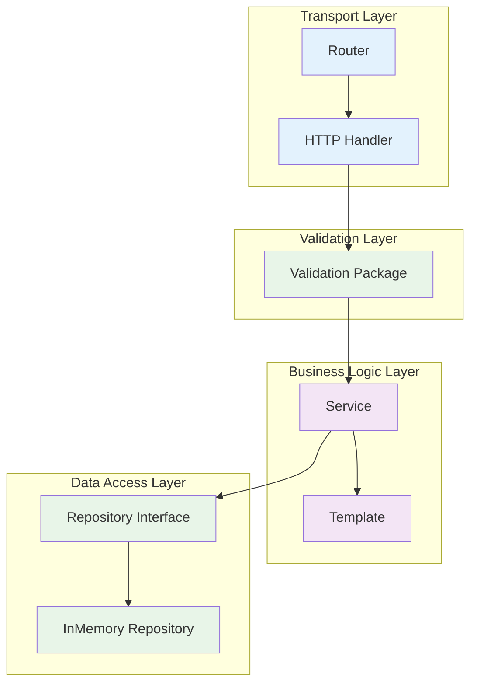

# Сервис сбора метрик и алертинга

Сервер для сбора рантайм-метрик, принимает репорты от агентов по протоколу HTTP.

## 🚀 Быстрый старт

### VS Code задачи

```bash
# Сборка проекта
Ctrl+Shift+B

# Запуск всех тестов
Ctrl+Shift+P → "Tasks: Run Task" → "Full Test Suite"

# Запуск сервера
Ctrl+Shift+P → "Tasks: Run Task" → "Run Server"

# Запуск агента
Ctrl+Shift+P → "Tasks: Run Task" → "Run Agent"
```

📖 **Подробная документация:** [.vscode/README.md](.vscode/README.md)

### Ручной запуск

```bash
# Сборка
go build -o cmd/server/server cmd/server/main.go cmd/server/cli.go cmd/server/cliutils.go
go build -o cmd/agent/agent cmd/agent/main.go cmd/agent/cli.go

# Запуск сервера
./cmd/server/server -a=localhost:9090

# Запуск агента
./cmd/agent/agent -a=localhost:9090 -r=2s
```

## Архитектура

Проект следует принципам чистой архитектуры с разделением на слои:

### 🏗️ **Ключевые принципы:**
- **Clean Architecture** - четкое разделение слоев
- **Dependency Injection** - инверсия зависимостей
- **Validation Layer** - отдельный слой валидации данных
- **Error Handling** - детальная обработка ошибок
- **Test-Driven Development** - полное покрытие тестами

### Архитектура



## Структура проекта

```
go-metrics/
├── cmd/
│   ├── server/             # Сервер приложения
│   └── agent/              # Агент сбора метрик
├── internal/
│   ├── app/                # Основная логика приложения
│   ├── httpserver/         # HTTP сервер
│   ├── router/             # Роутер
│   ├── handler/            # HTTP обработчики
│   ├── service/            # Бизнес-логика
│   ├── validation/         # Валидация данных
│   ├── template/           # HTML шаблоны
│   ├── routes/             # HTTP маршруты
│   ├── model/              # Структуры данных
│   ├── repository/         # Работа с данными
│   └── agent/              # Логика агента
├── migrations/             # Миграции БД
├── pkg/                    # Публичные пакеты
└── README.md              # Документация проекта
```

## 🚀 Функциональность

### Поддерживаемые типы метрик

1. **Gauge** (float64) - новое значение замещает предыдущее
2. **Counter** (int64) - новое значение добавляется к предыдущему

### HTTP API

#### Обновление метрики
```bash
POST /update/{ТИП_МЕТРИКИ}/{ИМЯ_МЕТРИКИ}/{ЗНАЧЕНИЕ_МЕТРИКИ}

# Примеры:
curl -X POST "http://localhost:8080/update/gauge/temperature/23.5"
curl -X POST "http://localhost:8080/update/counter/requests/100"
```

#### Получение значения метрики
```bash
GET /value/{ТИП_МЕТРИКИ}/{ИМЯ_МЕТРИКИ}

# Примеры:
curl "http://localhost:8080/value/gauge/temperature"
curl "http://localhost:8080/value/counter/requests"
```

#### Просмотр всех метрик
```bash
GET /

# Открыть в браузере: http://localhost:8080/
```

## Тестирование

### VS Code задачи
```bash
# Полный набор тестов
Ctrl+Shift+P → "Tasks: Run Task" → "Full Test Suite"

# Только unit тесты
Ctrl+Shift+P → "Tasks: Run Task" → "Run All Tests"

# Автотесты
Ctrl+Shift+P → "Tasks: Run Task" → "Run Auto Tests Iteration4"
```

### Ручной запуск
```bash
# Все тесты
go test ./... -v

# Тесты с покрытием
go test ./... -v -cover
```

## Документация пакетов

- 📖 **Сервер:** [cmd/server/README.md](cmd/server/README.md)
- 📖 **Агент:** [cmd/agent/README.md](cmd/agent/README.md)
- 📖 **Приложение:** [internal/app/README.md](internal/app/README.md)
- 📖 **HTTP сервер:** [internal/httpserver/README.md](internal/httpserver/README.md)
- 📖 **Роутер:** [internal/router/README.md](internal/router/README.md)
- 📖 **Обработчики:** [internal/handler/README.md](internal/handler/README.md)
- 📖 **Сервис:** [internal/service/README.md](internal/service/README.md)
- 📖 **Валидация:** [internal/validation/README.md](internal/validation/README.md)
- 📖 **Шаблоны:** [internal/template/README.md](internal/template/README.md)
- 📖 **Маршруты:** [internal/routes/README.md](internal/routes/README.md)
- 📖 **Модели:** [internal/model/README.md](internal/model/README.md)
- 📖 **Репозиторий:** [internal/repository/README.md](internal/repository/README.md)
