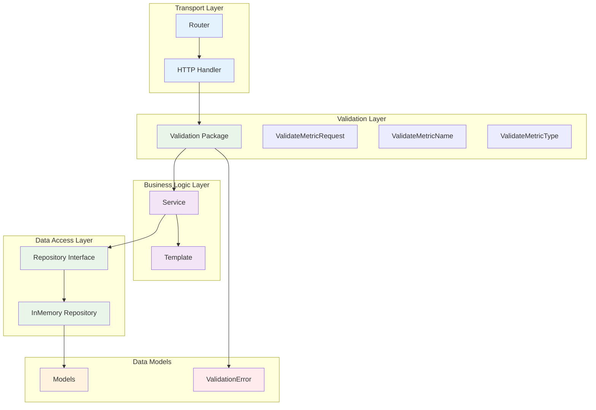
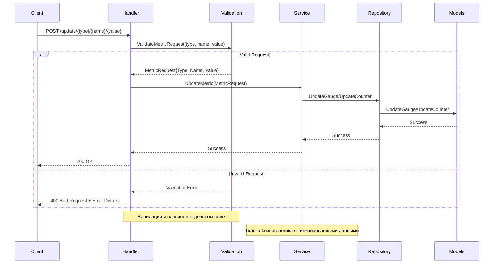

# Сервис сбора метрик и алертинга

Сервер для сбора рантайм-метрик, принимает репорты от агентов по протоколу HTTP.

## 🚀 Быстрый старт

### VS Code задачи

```bash
# Сборка проекта
Ctrl+Shift+B

# Запуск всех тестов (unit + автотесты)
Ctrl+Shift+P → "Tasks: Run Task" → "Full Test Suite"

# Запуск только автотестов
Ctrl+Shift+P → "Tasks: Run Task" → "Run Auto Tests Iteration4"
```

📖 **Подробная документация по VS Code задачам:** [.vscode/README.md](.vscode/README.md)

### Ручной запуск

```bash
# Сборка
go build -o cmd/server/server cmd/server/main.go cmd/server/cli.go cmd/server/cliutils.go
go build -o cmd/agent/agent cmd/agent/main.go cmd/agent/cli.go

# Запуск сервера
./cmd/server/server -a=localhost:9090

# Запуск агента
./cmd/agent/agent -a=localhost:9090 -r=2s

# Автотесты
../auto-tests/metricstest -test.v -test.run=^TestIteration4$ -binary-path=cmd/server/server -agent-binary-path=cmd/agent/agent -source-path=. -server-port=9091
```

## Архитектура

Проект следует принципам чистой архитектуры с разделением на слои и включает современные практики разработки:

### 🏗️ **Ключевые принципы:**
- **Clean Architecture** - четкое разделение слоев
- **Dependency Injection** - инверсия зависимостей
- **Graceful Shutdown** - корректная остановка сервера
- **Error Handling** - детальная обработка ошибок с кастомными типами
- **Test-Driven Development** - полное покрытие тестами
- **Security First** - безопасная обработка CLI аргументов
- **Code Quality** - рефакторинг и устранение дублирования
- **Validation Layer** - отдельный слой валидации данных

### Новая архитектура с валидацией



### Поток данных с валидацией



## Структура проекта

```
go-metrics/
├── .vscode/
│   ├── tasks.json           # VS Code задачи для сборки и тестирования
│   ├── README.md            # Документация по VS Code задачам
│   ├── launch.json          # Конфигурация отладки
│   ├── extensions.json      # Рекомендуемые расширения
│   └── settings.json        # Настройки VS Code
├── cmd/
│   ├── server/
│   │   ├── main.go          # Точка входа сервера
│   │   ├── main_test.go     # Тесты main функции
│   │   ├── cli.go           # CLI логика и парсинг флагов
│   │   ├── cli_test.go      # Тесты CLI логики
│   │   ├── cliutils.go      # Утилиты CLI и кастомные ошибки
│   │   ├── cliutils_test.go # Тесты утилит CLI
│   │   └── README.md        # Документация сервера
│   └── agent/
│       ├── main.go          # Точка входа агента
│       └── README.md        # Документация агента
├── internal/
│   ├── app/
│   │   ├── app.go           # Основная логика приложения
│   │   ├── config.go        # Конфигурация приложения
│   │   ├── app_test.go      # Тесты приложения
│   │   └── README.md        # Документация пакета app
│   ├── httpserver/
│   │   ├── server.go        # Логика HTTP сервера
│   │   ├── server_test.go   # Тесты сервера
│   │   └── README.md        # Документация пакета httpserver
│   ├── router/
│   │   ├── router.go        # Роутер (обертка над chi роутером)
│   │   ├── router_test.go   # Тесты роутера
│   │   └── README.md        # Документация пакета router
│   ├── handler/
│   │   ├── metrics.go       # HTTP обработчики
│   │   └── metrics_test.go  # Тесты обработчиков
│   ├── service/
│   │   ├── metrics.go       # Бизнес-логика
│   │   └── metrics_test.go  # Тесты сервиса
│   ├── validation/
│   │   ├── metrics.go       # Валидация метрик
│   │   └── metrics_test.go  # Тесты валидации
│   ├── template/
│   │   ├── metrics.go       # HTML шаблоны
│   │   ├── metrics_test.go  # Тесты шаблонов
│   │   └── README.md        # Документация пакета template
│   ├── routes/
│   │   ├── metrics.go       # Настройка HTTP маршрутов
│   │   ├── metrics_test.go  # Тесты маршрутов
│   │   └── README.md        # Документация пакета routes
│   ├── model/
│   │   ├── metrics.go       # Структуры данных
│   │   └── README.md        # Документация пакета model
│   ├── repository/
│   │   ├── metrics.go       # Интерфейс Repository
│   │   ├── memory.go        # InMemory реализация
│   │   ├── memory_test.go   # Тесты Repository
│   │   └── README.md        # Документация пакета repository
│   ├── agent/
│   │   ├── agent.go         # Логика агента
│   │   ├── config.go        # Конфигурация агента
│   │   ├── metrics.go       # Сбор метрик
│   │   └── *_test.go        # Тесты агента
│   └── config/              # Конфигурация
├── migrations/              # Миграции БД
├── pkg/                     # Публичные пакеты
├── go.mod                   # Зависимости
├── go.sum                   # Хеши зависимостей
└── README.md               # Документация проекта
```

## 🚀 Функциональность

### Поддерживаемые типы метрик

1. **Gauge** (float64) - новое значение замещает предыдущее
2. **Counter** (int64) - новое значение добавляется к предыдущему

### HTTP API

Сервер доступен по адресу `http://localhost:8080`

#### Обновление метрики

```
POST /update/{ТИП_МЕТРИКИ}/{ИМЯ_МЕТРИКИ}/{ЗНАЧЕНИЕ_МЕТРИКИ}
Content-Type: text/plain
```

**Примеры:**
```bash
# Gauge метрика
curl -X POST "http://localhost:8080/update/gauge/temperature/23.5" \
     -H "Content-Type: text/plain"

# Counter метрика
curl -X POST "http://localhost:8080/update/counter/requests/100" \
     -H "Content-Type: text/plain"

# Попытка добавить некорректную метрику
curl -X POST "http://localhost:8080/update/gauge/temperature/abc"
# Ответ: 400 Bad Request
# validation error for field 'value' with value 'abc': must be a valid float number
```

#### Получение значения метрики

```
GET /value/{ТИП_МЕТРИКИ}/{ИМЯ_МЕТРИКИ}
Content-Type: text/plain
```

**Примеры:**
```bash
# Получить значение gauge метрики
curl "http://localhost:8080/value/gauge/temperature"
# Ответ: 23.5

# Получить значение counter метрики
curl "http://localhost:8080/value/counter/requests"
# Ответ: 100
```

#### Просмотр всех метрик

```
GET /
Content-Type: text/html
```

**Пример:**
```bash
# Открыть в браузере или получить HTML
curl "http://localhost:8080/"
```

Возвращает HTML-страницу со списком всех метрик, сгруппированных по типам.

#### Коды ответов

- `200 OK` - запрос выполнен успешно
- `400 Bad Request` - некорректный тип метрики или значение (с детальным описанием ошибки)
- `404 Not Found` - метрика не найдена или отсутствует имя метрики
- `405 Method Not Allowed` - неподдерживаемый HTTP метод
- `500 Internal Server Error` - внутренняя ошибка сервера

## 🚀 Запуск

### VS Code задачи (рекомендуется)

📖 **Подробная документация:** [.vscode/README.md](.vscode/README.md)

```bash
# Сборка проекта
Ctrl+Shift+B

# Запуск всех тестов (unit + автотесты)
Ctrl+Shift+P → "Tasks: Run Task" → "Full Test Suite"

# Запуск только автотестов
Ctrl+Shift+P → "Tasks: Run Task" → "Run Auto Tests Iteration4"

# Запуск сервера
Ctrl+Shift+P → "Tasks: Run Task" → "Run Server"

# Запуск агента
Ctrl+Shift+P → "Tasks: Run Task" → "Run Agent"
```

### Сервер

📖 **Подробная документация:** [cmd/server/README.md](cmd/server/README.md)

```bash
# Запуск с адресом по умолчанию (localhost:8080)
go run cmd/server/main.go cmd/server/cli.go cmd/server/cliutils.go

# Запуск с кастомным адресом
go run cmd/server/main.go cmd/server/cli.go cmd/server/cliutils.go -a=localhost:9090

# Запуск сбилженного сервера
./cmd/server/server -a=localhost:9090
```

**Поддерживаемые флаги:**
- `-a, --address` - адрес эндпоинта HTTP-сервера (по умолчанию: "localhost:8080")
- `-h, --help` - показать справку по флагам

### Агент

📖 **Подробная документация:** [cmd/agent/README.md](cmd/agent/README.md)

```bash
# Запуск агента
go run cmd/agent/main.go cmd/agent/cli.go

# Компиляция в бинарный файл
go build -o cmd/agent/agent ./cmd/agent/

# Компиляция с версией
go build -ldflags "-X main.Version=1.0.0" -o cmd/agent/agent ./cmd/agent/

# Запуск с кастомными настройками
./cmd/agent/agent -a http://example.com:9090 -p 5 -r 15 -v

# Только verbose логирование
./cmd/agent/agent -v
```

**Поддерживаемые флаги:**
- `-a, --a` - HTTP server endpoint address (по умолчанию: `http://localhost:8080`)
- `-p, --p` - Poll interval in seconds (по умолчанию: `2`)
- `-r, --r` - Report interval in seconds (по умолчанию: `10`)
- `-v, --v` - Enable verbose logging (по умолчанию: `false`)
- `-h, --help` - Show help

## Тестирование

### VS Code задачи (рекомендуется)

```bash
# Полный набор тестов
Ctrl+Shift+P → "Tasks: Run Task" → "Full Test Suite"

# Только unit тесты
Ctrl+Shift+P → "Tasks: Run Task" → "Run All Tests"

# Тесты с покрытием
Ctrl+Shift+P → "Tasks: Run Task" → "Run Tests with Coverage"

# Автотесты
Ctrl+Shift+P → "Tasks: Run Task" → "Run Auto Tests Iteration4"
```

### Ручной запуск тестов

```bash
# Все тесты
go test ./... -v

# Тесты с покрытием
go test ./... -v -cover

# Автотесты
../auto-tests/metricstest -test.v -test.run=^TestIteration4$ -binary-path=cmd/server/server -agent-binary-path=cmd/agent/agent -source-path=. -server-port=9091
```

### Покрытие тестами

Проект покрыт юнит-тестами для всех основных компонентов:

- ✅ **Приложение** - тестирование инициализации и конфигурации
- ✅ **HTTP сервер** - интеграционные тесты сервера
- ✅ **Роутер** - тестирование маршрутизации
- ✅ **HTTP хендлеры** - тестирование API endpoints
- ✅ **Сервисный слой** - тестирование бизнес-логики
- ✅ **Валидация** - тестирование валидации данных (100% покрытие)
- ✅ **Репозиторий** - тестирование работы с данными
- ✅ **Модели данных** - тестирование структур и интерфейсов
- ✅ **Агент** - тестирование сбора метрик (100% покрытие)
- ✅ **CLI** - тестирование парсинга флагов и обработки ошибок
- ✅ **Шаблоны** - тестирование генерации HTML
- ✅ **Маршруты** - тестирование настройки HTTP endpoints
- ✅ **Автотесты** - интеграционные тесты агента и сервера

## Структура данных

### Модели (internal/model)

```go
// Константы типов метрик
const (
    Counter = "counter"
    Gauge   = "gauge"
)

// Типы-алиасы
type GaugeMetrics map[string]float64
type CounterMetrics map[string]int64

// Кастомная ошибка валидации
type ValidationError struct {
    Field   string
    Value   string
    Message string
}

func (e ValidationError) Error() string {
    return fmt.Sprintf("validation error for field '%s' with value '%s': %s", e.Field, e.Value, e.Message)
}

// Предикат для проверки типа ошибки
func IsValidationError(err error) bool {
    _, ok := err.(ValidationError)
    return ok
}
```

### Валидация (internal/validation) 🆕

```go
// Типизированная структура запроса
type MetricRequest struct {
    Type  string
    Name  string
    Value any // float64 для gauge, int64 для counter
}

// Валидация и парсинг запроса
func ValidateMetricRequest(metricType, name, value string) (*MetricRequest, error)

// Валидация отдельных полей
func ValidateMetricName(name string) error
func ValidateMetricType(metricType string) error
```

### Сервис (internal/service)

```go
type MetricsService struct {
    repository repository.MetricsRepository
}

// Обновление метрики с готовыми валидированными данными
func (s *MetricsService) UpdateMetric(req *validation.MetricRequest) error

// Бизнес-логика для разных типов метрик
func (s *MetricsService) updateGaugeMetric(name string, value float64) error
func (s *MetricsService) updateCounterMetric(name string, value int64) error
```

### Обработчики (internal/handler)

```go
type MetricsHandler struct {
    service *service.MetricsService
}

// Обновление метрики с валидацией
func (h *MetricsHandler) UpdateMetric(w http.ResponseWriter, r *http.Request) {
    // Валидация и парсинг
    metricReq, err := validation.ValidateMetricRequest(metricType, metricName, metricValue)
    if err != nil {
        if models.IsValidationError(err) {
            http.Error(w, err.Error(), http.StatusBadRequest)
        } else {
            http.Error(w, "Internal server error", http.StatusInternalServerError)
        }
        return
    }
    
    // Вызов сервиса с готовыми данными
    err = h.service.UpdateMetric(metricReq)
}
```

## Примеры использования

### Работа с валидацией

```go
// Валидация и парсинг запроса
metricReq, err := validation.ValidateMetricRequest(metricType, metricName, metricValue)
if err != nil {
    if models.IsValidationError(err) {
        // Обработка ошибки валидации
        http.Error(w, err.Error(), http.StatusBadRequest)
    } else {
        // Обработка других ошибок
        http.Error(w, "Internal server error", http.StatusInternalServerError)
    }
    return
}

// Использование типизированных данных
err = service.UpdateMetric(metricReq)
```

### Кастомные типы ошибок

```go
// Кастомные типы ошибок
type HelpRequestedError struct{}
type InvalidAddressError struct {
    Address string
    Reason  string
}
type ValidationError struct {
    Field   string
    Value   string
    Message string
}

// Функции-предикаты для проверки типов ошибок
func IsHelpRequested(err error) bool
func IsInvalidAddress(err error) bool
func IsValidationError(err error) bool

// Централизованная обработка ошибок
func handleError(err error) {
    if err == nil {
        return
    }

    if IsHelpRequested(err) {
        osExit(0)
        return
    }

    if IsInvalidAddress(err) {
        log.Printf("Ошибка конфигурации: %v", err)
        osExit(1)
        return
    }

    log.Fatal(err)
}
```
