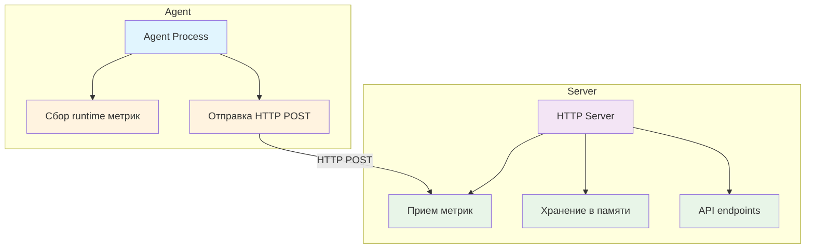
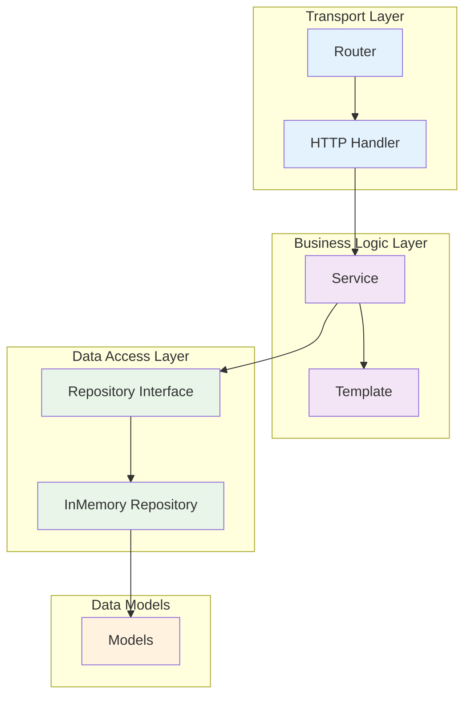
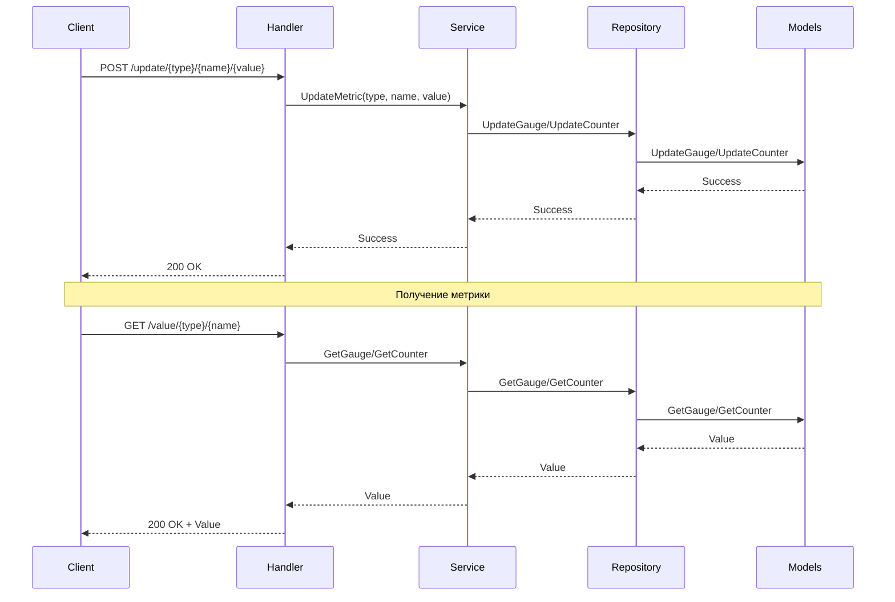
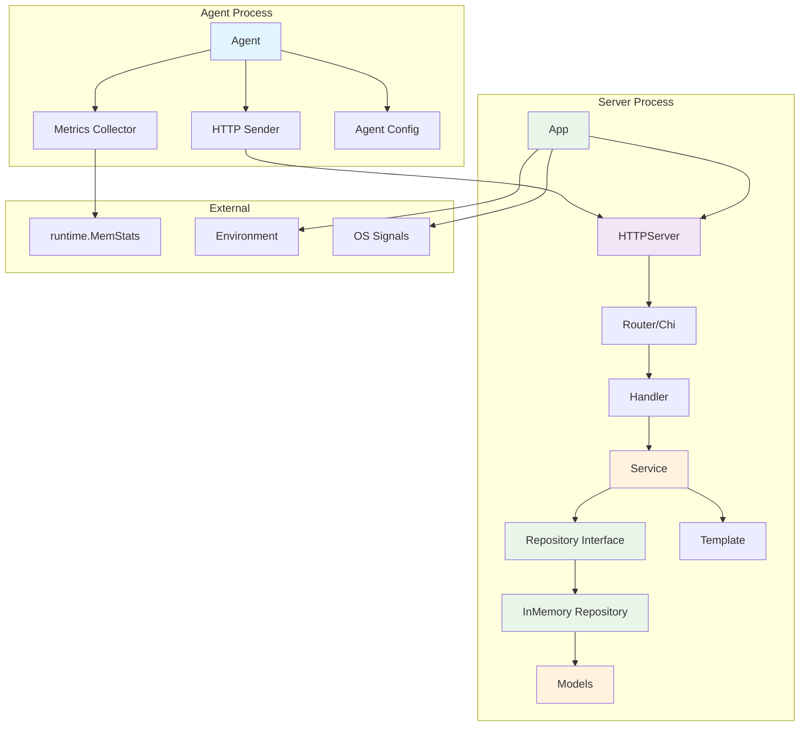

# Сервис сбора метрик и алертинга

Сервер для сбора рантайм-метрик, принимает репорты от агентов по протоколу HTTP.

## Архитектура

Проект следует принципам чистой архитектуры с разделением на слои и включает современные практики разработки:

### 🏗️ **Ключевые принципы:**
- **Clean Architecture** - четкое разделение слоев
- **Dependency Injection** - инверсия зависимостей
- **Graceful Shutdown** - корректная остановка сервера
- **Error Handling** - детальная обработка ошибок с кастомными типами
- **Test-Driven Development** - полное покрытие тестами (81.6%)
- **Security First** - безопасная обработка CLI аргументов
- **Code Quality** - рефакторинг и устранение дублирования

### Общая архитектура системы



### Архитектура сервера (Clean Architecture)



### Поток данных



### Полная архитектура системы



- **`cmd/`** - точки входа в приложение (server, agent)
- **`internal/`** - внутренняя логика приложения
  - **`app/`** - основная логика инициализации приложения
  - **`httpserver/`** - HTTP сервер и его логика
  - **`router/`** - роутер (обертка над chi роутером)
  - **`routes/`** - настройка HTTP маршрутов
  - **`model/`** - структуры данных (только модели)
  - **`repository/`** - интерфейсы и реализации для работы с данными
  - **`service/`** - бизнес-логика
  - **`handler/`** - HTTP обработчики
  - **`template/`** - HTML шаблоны
  - **`agent/`** - агент для сбора метрик
  - **`config/`** - конфигурация

## Структура проекта

```
go-metrics/
├── cmd/
│   ├── server/
│   │   ├── main.go          # Точка входа сервера
│   │   ├── cli.go           # CLI логика и парсинг флагов
│   │   └── README.md        # Документация сервера
│   └── agent/
│       ├── main.go          # Точка входа агента
│       └── README.md        # Документация агента
├── internal/
│   ├── app/
│   │   ├── app.go           # Основная логика приложения
│   │   ├── config.go        # Конфигурация приложения
│   │   ├── app_test.go      # Тесты приложения
│   │   └── README.md        # Документация пакета app
│   ├── httpserver/
│   │   ├── server.go        # Логика HTTP сервера
│   │   ├── server_test.go   # Тесты сервера
│   │   └── README.md        # Документация пакета httpserver
│   ├── router/
│   │   ├── router.go        # Роутер (обертка над chi роутером)
│   │   ├── router_test.go   # Тесты роутера
│   │   └── README.md        # Документация пакета router
│   ├── handler/
│   │   ├── metrics.go       # HTTP обработчики
│   │   └── metrics_test.go  # Тесты обработчиков
│   ├── service/
│   │   ├── metrics.go       # Бизнес-логика
│   │   └── metrics_test.go  # Тесты сервиса
│   ├── template/
│   │   ├── metrics.go       # HTML шаблоны
│   │   ├── metrics_test.go  # Тесты шаблонов
│   │   └── README.md        # Документация пакета template
│   ├── routes/
│   │   ├── metrics.go       # Настройка HTTP маршрутов
│   │   ├── metrics_test.go  # Тесты маршрутов
│   │   └── README.md        # Документация пакета routes
│   ├── model/
│   │   ├── metrics.go       # Структуры данных
│   │   └── README.md        # Документация пакета model
│   ├── repository/
│   │   ├── metrics.go       # Интерфейс Repository
│   │   ├── memory.go        # InMemory реализация
│   │   ├── memory_test.go   # Тесты Repository
│   │   └── README.md        # Документация пакета repository
│   ├── agent/
│   │   ├── agent.go         # Логика агента
│   │   ├── config.go        # Конфигурация агента
│   │   ├── metrics.go       # Сбор метрик
│   │   └── *_test.go        # Тесты агента
│   └── config/              # Конфигурация
├── migrations/              # Миграции БД
├── pkg/                     # Публичные пакеты
├── go.mod                   # Зависимости
├── go.sum                   # Хеши зависимостей
└── README.md               # Документация проекта
```

## 🚀 Функциональность

### Поддерживаемые типы метрик

1. **Gauge** (float64) - новое значение замещает предыдущее
2. **Counter** (int64) - новое значение добавляется к предыдущему

### 🔧 **Последние улучшения**

#### Graceful Shutdown
- ✅ Корректная остановка HTTP сервера
- ✅ Обработка сигналов SIGINT/SIGTERM
- ✅ Таймаут 30 секунд для завершения запросов
- ✅ Логирование процесса остановки

#### Безопасность и качество кода
- ✅ **Исправлена потенциальная паника с help флагом** - добавлена проверка на nil
- ✅ **Улучшена обработка ошибок** - вынесена в отдельную функцию `handleError`
- ✅ **Устранено дублирование кода** - централизованная обработка ошибок
- ✅ **Улучшена тестируемость** - добавлена переменная `osExit` для подмены в тестах

#### Тестирование
- ✅ **Покрытие тестами увеличено с 68.1% до 81.6%**
- ✅ **Добавлены тесты для реальных сценариев** - тестирование os.Exit в отдельном процессе
- ✅ **Улучшены интеграционные тесты** - table-driven tests для различных сценариев
- ✅ **Добавлены тесты для edge cases** - граничные случаи обработки ошибок

### HTTP API

Сервер доступен по адресу `http://localhost:8080`

#### Обновление метрики

```
POST /update/{ТИП_МЕТРИКИ}/{ИМЯ_МЕТРИКИ}/{ЗНАЧЕНИЕ_МЕТРИКИ}
Content-Type: text/plain
```

**Примеры:**
```bash
# Gauge метрика
curl -X POST "http://localhost:8080/update/gauge/temperature/23.5" \
     -H "Content-Type: text/plain"

# Counter метрика
curl -X POST "http://localhost:8080/update/counter/requests/100" \
     -H "Content-Type: text/plain"
```

#### Получение значения метрики

```
GET /value/{ТИП_МЕТРИКИ}/{ИМЯ_МЕТРИКИ}
Content-Type: text/plain
```

**Примеры:**
```bash
# Получить значение gauge метрики
curl "http://localhost:8080/value/gauge/temperature"
# Ответ: 23.5

# Получить значение counter метрики
curl "http://localhost:8080/value/counter/requests"
# Ответ: 100
```

#### Просмотр всех метрик

```
GET /
Content-Type: text/html
```

**Пример:**
```bash
# Открыть в браузере или получить HTML
curl "http://localhost:8080/"
```

Возвращает HTML-страницу со списком всех метрик, сгруппированных по типам.

#### Коды ответов

- `200 OK` - запрос выполнен успешно
- `400 Bad Request` - некорректный тип метрики или значение
- `404 Not Found` - метрика не найдена или отсутствует имя метрики
- `405 Method Not Allowed` - неподдерживаемый HTTP метод

### Агент для сбора метрик

Агент автоматически собирает метрики из пакета `runtime` и отправляет их на сервер:

#### Собираемые метрики

**Gauge метрики из runtime:**
- Alloc, BuckHashSys, Frees, GCCPUFraction, GCSys
- HeapAlloc, HeapIdle, HeapInuse, HeapObjects, HeapReleased
- HeapSys, LastGC, Lookups, MCacheInuse, MCacheSys
- MSpanInuse, MSpanSys, Mallocs, NextGC, NumForcedGC
- NumGC, OtherSys, PauseTotalNs, StackInuse, StackSys
- Sys, TotalAlloc

**Дополнительные метрики:**
- RandomValue (gauge) - случайное значение
- PollCount (counter) - счетчик обновлений

#### Конфигурация агента

- **PollInterval**: 2 секунды - частота сбора метрик
- **ReportInterval**: 10 секунд - частота отправки метрик
- **ServerURL**: http://localhost:8080

## Зависимости

### Внешние пакеты

- **`github.com/go-chi/chi/v5`** - HTTP роутер для маршрутизации запросов
- **`github.com/stretchr/testify/assert`** - библиотека для тестирования (в некоторых тестах)

### Стандартные пакеты

- **`sync`** - потокобезопасность (RWMutex)
- **`net/http`** - HTTP сервер и клиент
- **`text/template`** - HTML шаблоны

## 🚀 Запуск

### Сервер

📖 **Подробная документация:** [cmd/server/README.md](cmd/server/README.md)

```bash
# Запуск с адресом по умолчанию (localhost:8080)
go run cmd/server/main.go

# Запуск с кастомным адресом
go run cmd/server/main.go -a=localhost:9090

# Запуск сбилженного сервера
./server -a=localhost:9090
```

**Поддерживаемые флаги:**
- `-a, --address` - адрес эндпоинта HTTP-сервера (по умолчанию: "localhost:8080")
- `-h, --help` - показать справку по флагам

Сервер запустится на указанном адресе (по умолчанию localhost:8080).

#### Graceful Shutdown

Сервер корректно обрабатывает сигналы завершения:

```bash
# Остановка Ctrl+C
^C
2025/08/08 09:11:02 Received signal: terminated
2025/08/08 09:11:02 Shutting down server gracefully...
2025/08/08 09:11:02 Server shutdown complete
```

### Агент

```bash
go run cmd/agent/main.go
```

Агент начнет собирать и отправлять метрики автоматически.

## Тестирование

### Запуск всех тестов

```bash
go test ./...
```

### Запуск тестов по пакетам

```bash
# Тесты приложения
go test ./internal/app/... -v

# Тесты HTTP сервера
go test ./internal/httpserver/... -v

# Тесты роутера
go test ./internal/router/... -v

# Тесты хендлеров
go test ./internal/handler/... -v

# Тесты сервиса
go test ./internal/service/... -v

# Тесты репозитория
go test ./internal/repository/... -v

# Тесты модели
go test ./internal/model/... -v

# Тесты агента
go test ./internal/agent/... -v

# Тесты шаблонов
go test ./internal/template/... -v

# Тесты маршрутов
go test ./internal/routes/... -v
```

### Покрытие тестами

Проект покрыт юнит-тестами для всех основных компонентов:

- ✅ **Приложение** - тестирование инициализации и конфигурации
- ✅ **HTTP сервер** - интеграционные тесты сервера
- ✅ **Роутер** - тестирование маршрутизации
- ✅ **HTTP хендлеры** - тестирование API endpoints
- ✅ **Сервисный слой** - тестирование бизнес-логики
- ✅ **Репозиторий** - тестирование работы с данными
- ✅ **Модели данных** - тестирование структур и интерфейсов (включая потокобезопасность)
- ✅ **Агент** - тестирование сбора метрик
- ✅ **Шаблоны** - тестирование генерации HTML
- ✅ **Маршруты** - тестирование настройки HTTP endpoints
- ✅ **CLI** - тестирование парсинга флагов и обработки ошибок (81.6% покрытие)
- ✅ **Валидация** - тестирование обработки ошибок с кастомными типами
- ✅ **Потокобезопасность** - тестирование конкурентного доступа
- ✅ **Edge cases** - тестирование граничных случаев и ошибок

## Структура данных

### Модели (internal/model)

Структуры данных для метрик:

```go
// Константы типов метрик
const (
    Counter = "counter"
    Gauge   = "gauge"
)

// Типы-алиасы
type GaugeMetrics map[string]float64
type CounterMetrics map[string]int64

// Структура метрики
type Metrics struct {
    ID    string   `json:"id"`
    MType string   `json:"type"`
    Delta *int64   `json:"delta,omitempty"`
    Value *float64 `json:"value,omitempty"`
    Hash  string   `json:"hash,omitempty"`
}
```

### Репозиторий (internal/repository)

Интерфейс для работы с данными:

```go
type MetricsRepository interface {
    UpdateGauge(name string, value float64) error
    UpdateCounter(name string, value int64) error
    GetGauge(name string) (float64, bool, error)
    GetCounter(name string) (int64, bool, error)
    GetAllGauges() (models.GaugeMetrics, error)
    GetAllCounters() (models.CounterMetrics, error)
}
```

**InMemoryRepository** - потокобезопасная реализация в памяти:

```go
type InMemoryMetricsRepository struct {
    Gauges   models.GaugeMetrics
    Counters models.CounterMetrics
    mu       sync.RWMutex
}
```

**Особенности:**
- **Потокобезопасность** - все операции защищены RWMutex
- **Абстракция данных** - сервис не зависит от конкретной реализации
- **Легкое тестирование** - можно мокать интерфейс
- **Расширяемость** - легко добавить PostgreSQL, Redis и т.д.

### Metrics

Структура для представления метрики:

```go
type Metrics struct {
    ID    string   `json:"id"`
    MType string   `json:"type"`
    Delta *int64   `json:"delta,omitempty"`
    Value *float64 `json:"value,omitempty"`
    Hash  string   `json:"hash,omitempty"`
}
```

### MetricsData

Структура для передачи данных в HTML шаблон:

```go
type MetricsData struct {
    Gauges       models.GaugeMetrics  // Gauge метрики
    Counters     models.CounterMetrics // Counter метрики
    GaugeCount   int                  // Количество gauge метрик
    CounterCount int                  // Количество counter метрик
}
```

### Routes

Функции для настройки HTTP маршрутов:

```go
// Настройка маршрутов метрик
func SetupMetricsRoutes(handler *handler.MetricsHandler) *chi.Mux

// Настройка маршрутов health check
func SetupHealthRoutes() *chi.Mux
```

**Настраиваемые маршруты:**
- `GET /` - отображение всех метрик (HTML)
- `POST /update/{type}/{name}/{value}` - обновление метрики
- `GET /value/{type}/{name}` - получение значения метрики
- `GET /health` - проверка состояния сервиса

## 🏗️ Архитектурные решения

### Разделение ответственности

- **`cmd/server/main.go`** - точка входа, инициализация приложения
- **`cmd/server/cli.go`** - CLI логика и парсинг флагов
- **`internal/httpserver/`** - инкапсуляция всей логики HTTP сервера с graceful shutdown
- **`internal/router/`** - абстракция над `chi` роутером для будущей расширяемости
- **`internal/handler/`** - HTTP обработчики, только парсинг запросов и валидация
- **`internal/service/`** - бизнес-логика, работа с метриками
- **`internal/template/`** - HTML шаблоны для отображения метрик
- **`internal/routes/`** - настройка HTTP маршрутов и их группировка
- **`internal/model/`** - структуры данных (только модели)
- **`internal/repository/`** - абстракция над источниками данных

## Отладка

Настроена конфигурация VS Code для отладки:

- **Debug Server** - отладка сервера
- **Debug Agent** - отладка агента

## Пример работы

### Запуск сервера

📖 **Подробная документация:** [cmd/server/README.md](cmd/server/README.md)

```bash
# Запуск с адресом по умолчанию (localhost:8080)
go run cmd/server/main.go

# Запуск с кастомным портом (localhost:9090)
go run cmd/server/main.go -a=9090

# Запуск с кастомным адресом и портом
go run cmd/server/main.go -a=127.0.0.1:9090

# Запуск сбилженного сервера
./server -a=localhost:9090
```

**Поддерживаемые флаги:**
- `-a, --address` - адрес эндпоинта HTTP-сервера (по умолчанию: "localhost:8080")
- `-h, --help` - показать справку по флагам

**Форматы адреса:**
- `localhost:8080` - полный адрес (хост:порт)
- `9090` - только порт (хост по умолчанию: localhost)
- `127.0.0.1:9090` - IP адрес с портом
- `:8080` - все интерфейсы на указанном порту

Сервер запустится на указанном адресе и будет доступен по соответствующему URL.

### Тестирование API

#### 1. Обновление метрик

```bash
# Добавить gauge метрику
curl -X POST "http://localhost:8080/update/gauge/temperature/23.5"

# Добавить counter метрику
curl -X POST "http://localhost:8080/update/counter/requests/100"
```

#### 2. Получение значений метрик

```bash
# Получить значение gauge метрики
curl "http://localhost:8080/value/gauge/temperature"
# Ответ: 23.5

# Получить значение counter метрики
curl "http://localhost:8080/value/counter/requests"
# Ответ: 100
```

#### 3. Просмотр всех метрик

```bash
# Открыть в браузере
open http://localhost:8080/

# Или получить HTML через curl
curl "http://localhost:8080/"
```

### Запуск агента

```bash
go run cmd/agent/main.go
```

Агент будет автоматически:
- Собирать 29 метрик из runtime каждые 2 секунды
- Отправлять их на сервер каждые 10 секунд
- Логировать все операции

### Полный цикл работы

1. Запустите сервер: `go run cmd/server/main.go`
2. Запустите агент: `go run cmd/agent/main.go`
3. Откройте браузер: `http://localhost:8080/`
4. Наблюдайте, как метрики обновляются в реальном времени

Все запросы возвращают статус 200 OK при успешном выполнении.

## Примеры использования

### Инициализация приложения

```go
package main

import (
    "log"
    "github.com/IgorKilipenko/metrical/internal/app"
)

func main() {
    // Парсим флаги командной строки
    addr, err := parseFlags()
    if err != nil {
        log.Fatal(err)
    }
    
    // Создаем конфигурацию
    config, err := app.NewConfig(addr)
    if err != nil {
        log.Fatal(err)
    }
    
    // Создаем приложение
    application := app.New(config)
    
    // Запускаем приложение с graceful shutdown
    if err := application.Run(); err != nil {
        log.Fatal(err)
    }
}
```

### Создание HTTP сервера

```go
// Создание сервера с валидацией
server, err := httpserver.NewServer(":8080")
if err != nil {
    log.Fatalf("Failed to create server: %v", err)
}

// Запуск сервера
if err := server.Start(); err != nil {
    log.Printf("Server error: %v", err)
}

// Graceful shutdown
ctx, cancel := context.WithTimeout(context.Background(), 30*time.Second)
defer cancel()
if err := server.Shutdown(ctx); err != nil {
    log.Printf("Shutdown error: %v", err)
}
```

### Работа с моделями

```go
// Создание метрики
metric := models.Metrics{
    ID:    "temperature",
    MType: models.Gauge,
    Value: &value,
}

// Работа с типами-алиасами
gauges := models.GaugeMetrics{"temp": 23.5}
counters := models.CounterMetrics{"requests": 100}

// Проверка типов метрик
if metric.MType == models.Gauge {
    // обработка gauge метрики
}
```

### Работа с репозиторием

```go
// Создание репозитория
repo := repository.NewInMemoryMetricsRepository()

// Обновление метрик
err := repo.UpdateGauge("temperature", 23.5)
err = repo.UpdateCounter("requests", 100)

// Получение метрик
value, exists, err := repo.GetGauge("temperature")
value, exists, err := repo.GetCounter("requests")

// Получение всех метрик
gauges, err := repo.GetAllGauges()
counters, err := repo.GetAllCounters()
```

### Настройка маршрутов

```go
// Создание хендлера
handler := handler.NewMetricsHandler(service)

// Настройка маршрутов через пакет routes
router := routes.SetupMetricsRoutes(handler)

// Добавление health check маршрутов
healthRouter := routes.SetupHealthRoutes()
```
