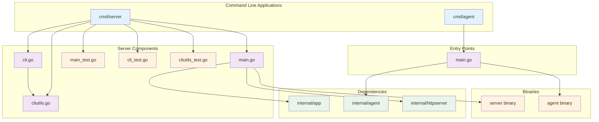
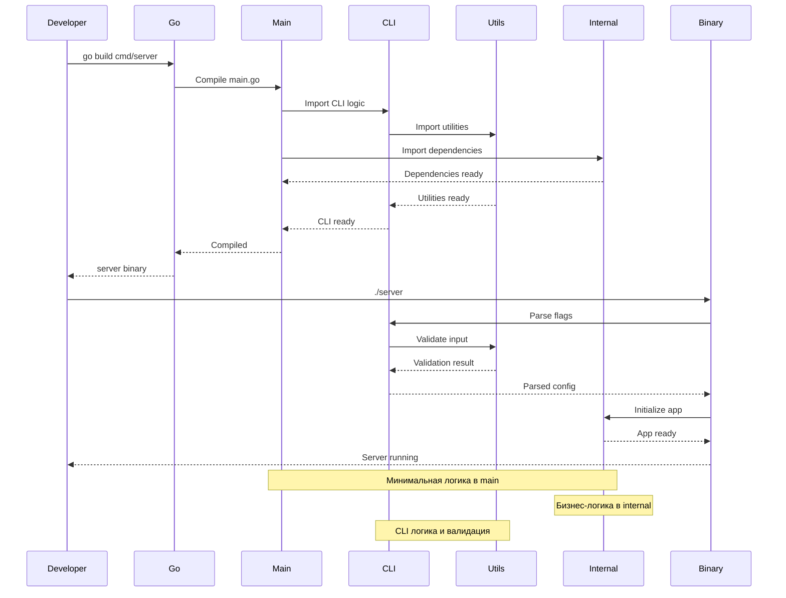

# cmd

В данной директории содержится код, который скомпилируется в бинарное приложение.

Рекомендуется помещать только код, необходимый для запуска приложения, но не бизнес-логику.

Название директории должно соответствовать названию приложения.

Директория `cmd/app_name` содержит:
- точку входа в приложение (функция `main`)
- инициализацию зависимостей (можно вынести в отдельный пакет `internal/app`)
- настройку и запуск HTTP-сервера (можно вынести в отдельный пакет `internal/router`)
- обработку сигналов завершения работы приложения
- CLI логику и парсинг флагов
- обработку ошибок и валидацию входных данных

## Архитектура команд



### Поток компиляции и запуска



## Структура cmd/server

```
cmd/server/
├── main.go          # Точка входа сервера
├── main_test.go     # Тесты main функции
├── cli.go           # CLI логика и парсинг флагов
├── cli_test.go      # Тесты CLI логики
├── cliutils.go      # Утилиты CLI и кастомные ошибки
├── cliutils_test.go # Тесты утилит CLI
└── README.md        # Документация сервера
```

### Компоненты cmd/server

#### main.go
- Точка входа сервера
- Парсинг флагов командной строки
- Создание конфигурации
- Инициализация и запуск приложения
- Централизованная обработка ошибок через `handleError`

#### cli.go
- Настройка Cobra команд
- Парсинг аргументов
- Валидация входных данных
- Обработка help флага с безопасной проверкой на nil
- Кастомный тип ошибки `HelpRequestedError`
- Валидация адреса с кастомным типом ошибки `InvalidAddressError`

#### cliutils.go
- Кастомные типы ошибок
- Функции-предикаты для проверки типов ошибок
- Валидация адреса с детальными сообщениями об ошибках

#### Тесты
- **main_test.go** - тестирование обработки ошибок, кодов выхода, интеграционные тесты
- **cli_test.go** - тестирование парсинга флагов, валидации адреса, обработки ошибок
- **cliutils_test.go** - тестирование кастомных типов ошибок и функций валидации

### Статистика тестирования cmd/server

- **Всего тестов:** 20+ функций тестирования
- **Подтестов:** 60+ сценариев
- **Покрытие:** 81.6% общего покрытия
- **Время выполнения:** ~34ms

### Запуск тестов

```bash
# Все тесты cmd/server
go test ./cmd/server/... -v

# Только тесты main функции
go test ./cmd/server/... -run "TestHandleError|TestMainFunction"

# Покрытие тестами
go test ./cmd/server/... -cover
```