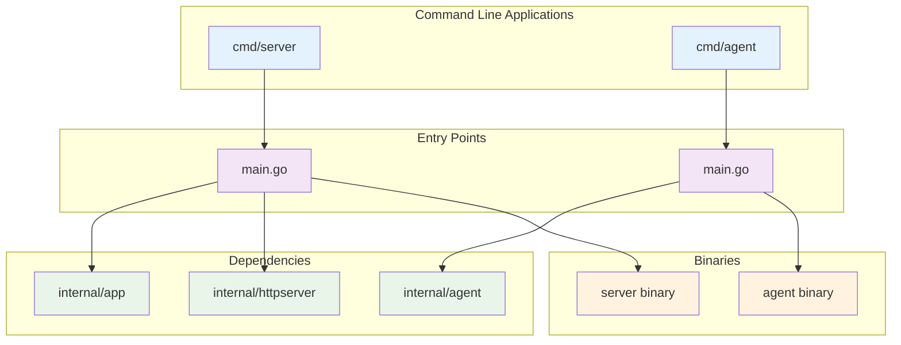
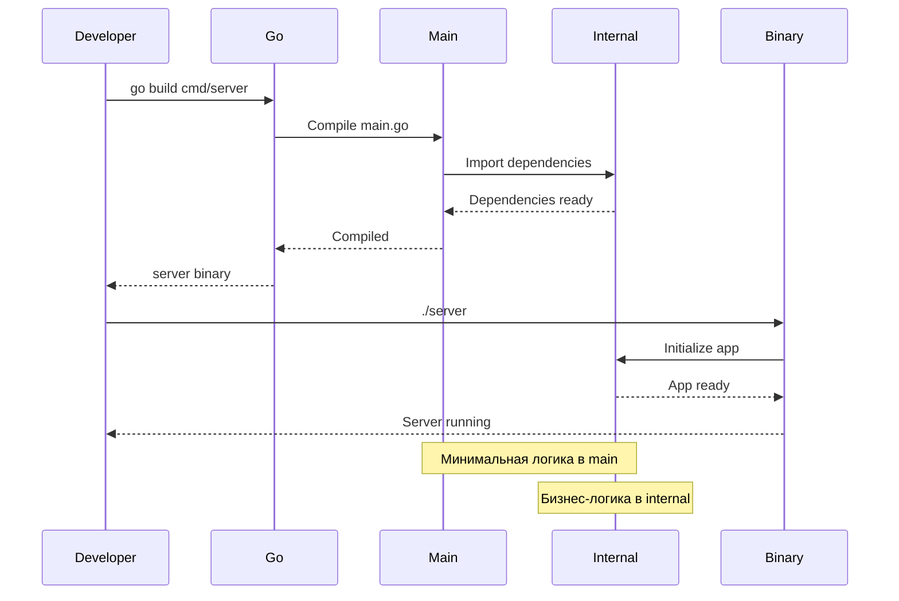

# cmd

В данной директории содержится код, который скомпилируется в бинарное приложение.

Рекомендуется помещать только код, необходимый для запуска приложения, но не бизнес-логику.

Название директории должно соответствовать названию приложения.

Директория `cmd/app_name` содержит:
- точку входа в приложение (функция `main`)
- инициализацию зависимостей (можно вынести в отдельный пакет `internal/app`)
- настройку и запуск HTTP-сервера (можно вынести в отдельный пакет `internal/router`)
- обработку сигналов завершения работы приложения

## Архитектура команд

### Поток компиляции и запуска

