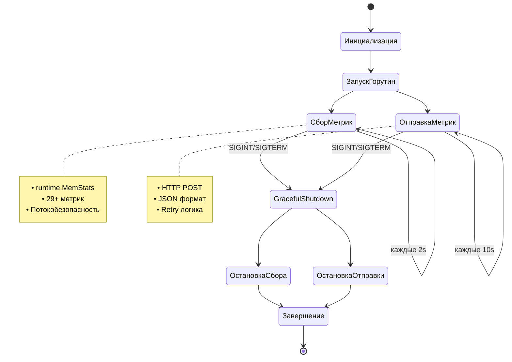

# cmd/agent

В данной директории содержится код **Агента для сбора метрик**, который компилируется в бинарное приложение.

## 📊 Функциональность

Агент автоматически собирает runtime метрики из Go приложения и отправляет их на сервер по HTTP.

### 🔄 Основные возможности

- **Сбор метрик** - автоматический сбор 29+ метрик из `runtime.MemStats`
- **Периодическая отправка** - отправка метрик на сервер каждые 10 секунд
- **Graceful shutdown** - корректная остановка при получении сигналов
- **Потокобезопасность** - использование `sync.RWMutex` для конкурентного доступа

### 📈 Собираемые метрики

#### Runtime метрики (Gauge):
- `Alloc` - текущее использование памяти
- `HeapAlloc` - использование heap памяти
- `HeapIdle` - свободная heap память
- `HeapInuse` - используемая heap память
- `NumGC` - количество сборок мусора
- `GCCPUFraction` - доля CPU времени на GC
- `PauseTotalNs` - общее время пауз GC
- `Mallocs` - количество аллокаций
- `Frees` - количество освобождений
- `TotalAlloc` - общий объем аллокаций
- И еще 17 метрик из `runtime.MemStats`

#### Дополнительные метрики:
- `RandomValue` (gauge) - случайное значение от 0 до 1
- `PollCount` (counter) - счетчик обновлений метрик

## ⚙️ Конфигурация

```go
type Config struct {
    ServerURL      string        // URL сервера (по умолчанию: http://localhost:8080)
    PollInterval   time.Duration // Интервал сбора метрик (по умолчанию: 2s)
    ReportInterval time.Duration // Интервал отправки метрик (по умолчанию: 10s)
}
```

## 🚀 Запуск

```bash
# Запуск агента
go run cmd/agent/main.go

# Компиляция в бинарный файл
go build -o agent cmd/agent/main.go
./agent
```

## 🛑 Graceful Shutdown

Агент корректно обрабатывает сигналы завершения:

```bash
# Остановка Ctrl+C
^C
2025/08/03 09:12:40 Received signal: terminated
2025/08/03 09:12:40 Stopping agent...
2025/08/03 09:12:40 Agent stopped gracefully
2025/08/03 09:12:40 Polling stopped
2025/08/03 09:12:40 Reporting stopped
2025/08/03 09:12:41 Agent shutdown completed
```

## 🧪 Тестирование

```bash
# Тесты агента
go test ./internal/agent/... -v

# Запуск с таймаутом для проверки работы
timeout 10s go run cmd/agent/main.go
```

## 📁 Структура кода

- `main.go` - точка входа, настройка graceful shutdown
- `internal/agent/agent.go` - основная логика агента
- `internal/agent/metrics.go` - структуры и функции для работы с метриками
- `internal/agent/agent_test.go` - unit тесты

## 🔄 Жизненный цикл



1. **Инициализация** - создание агента с конфигурацией
2. **Запуск горутин** - параллельный сбор и отправка метрик
3. **Сбор метрик** - каждые 2 секунды из `runtime.MemStats`
4. **Отправка метрик** - каждые 10 секунд на сервер
5. **Graceful shutdown** - корректная остановка при сигналах

## 📊 Пример логов

```
2025/08/03 09:12:30 Starting metrics agent...
2025/08/03 09:12:32 Collected 29 metrics
2025/08/03 09:12:34 Collected 29 metrics
2025/08/03 09:12:36 Collected 29 metrics
2025/08/03 09:12:38 Collected 29 metrics
2025/08/03 09:12:40 Received signal: terminated
2025/08/03 09:12:40 Stopping agent...
2025/08/03 09:12:40 Agent stopped gracefully
```
