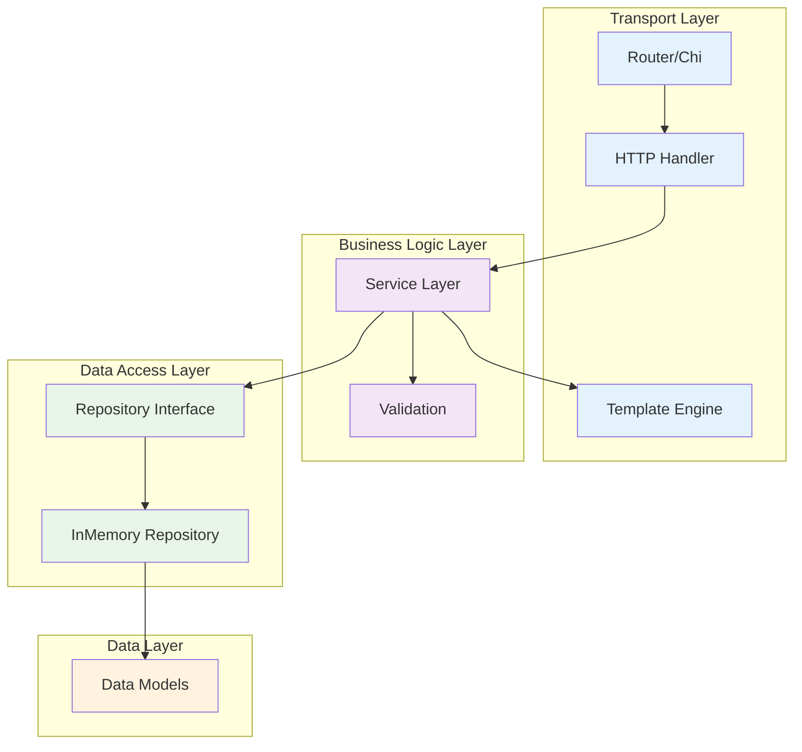
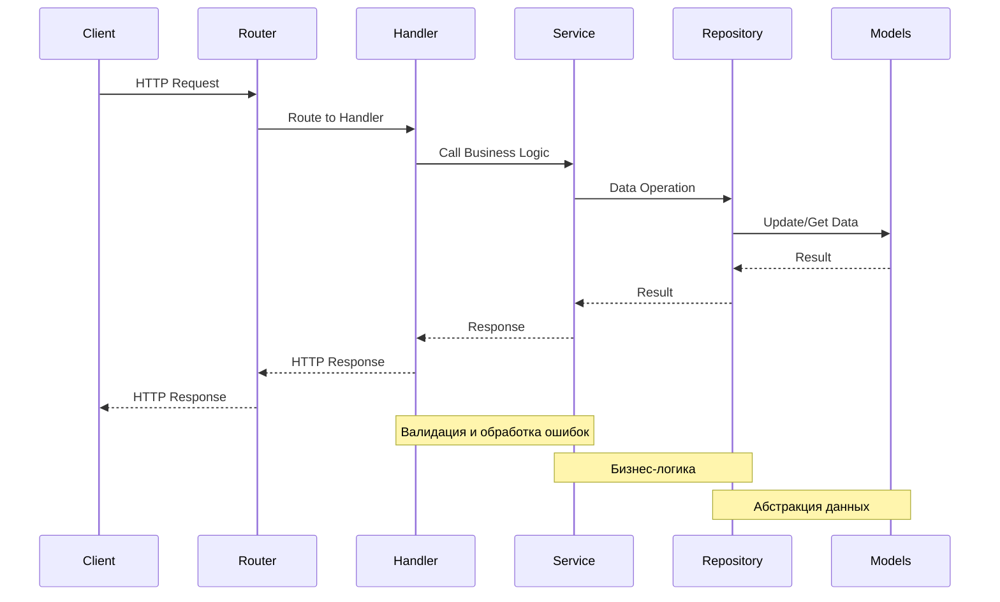

# cmd/server

HTTP сервер для приема метрик от агента.

## Описание

Сервер принимает POST запросы для обновления метрик в формате:
```
POST /update/<ТИП_МЕТРИКИ>/<ИМЯ_МЕТРИКИ>/<ЗНАЧЕНИЕ_МЕТРИКИ>
```

Сервер использует пакет `internal/httpserver` для управления HTTP сервером и маршрутизацией.

### Поддерживаемые типы метрик:
- `gauge` - метрики с плавающей точкой (заменяют предыдущее значение)
- `counter` - счетчики (накапливают значения)

### Примеры запросов:
```bash
# Обновление gauge метрики
curl -X POST http://localhost:8080/update/gauge/memory_usage/85.7

# Обновление counter метрики
curl -X POST http://localhost:8080/update/counter/request_count/1
```

## Структура проекта

```
cmd/server/
├── main.go          # Точка входа сервера
├── cli.go           # CLI логика и парсинг флагов
├── cli_test.go      # Тесты CLI логики
└── README.md        # Документация сервера

internal/
├── app/
│   ├── app.go           # Основная логика приложения
│   ├── config.go        # Конфигурация приложения
│   ├── app_test.go      # Тесты приложения
│   └── README.md        # Документация пакета app
├── httpserver/
│   ├── server.go        # Логика HTTP сервера
│   ├── server_test.go   # Тесты сервера
│   └── README.md        # Документация пакета httpserver
├── handler/
│   ├── metrics.go       # HTTP обработчики
│   └── metrics_test.go  # Тесты обработчиков
├── service/
│   ├── metrics.go       # Бизнес-логика
│   └── metrics_test.go  # Тесты сервиса
├── repository/
│   ├── metrics.go       # Интерфейс Repository
│   ├── memory.go        # InMemory реализация
│   ├── memory_test.go   # Тесты Repository
│   └── README.md        # Документация пакета repository
├── model/
│   ├── metrics.go       # Структуры данных
│   └── README.md        # Документация пакета model
├── router/
│   ├── router.go        # Роутер (обертка над chi)
│   └── router_test.go   # Тесты роутера
├── routes/
│   ├── metrics.go       # Настройка HTTP маршрутов
│   └── metrics_test.go  # Тесты маршрутов
└── template/
    ├── metrics.go       # HTML шаблоны
    └── metrics_test.go  # Тесты шаблонов
```

## Тесты

### Тесты сервера (`internal/httpserver/server_test.go`)
- `TestNewServer` - тестирование создания сервера
- `TestServerIntegration` - интеграционные тесты HTTP сервера
- `TestServerEndToEnd` - end-to-end тестирование полного цикла работы с метриками
- `TestServerBasicFunctionality` - тестирование базовой функциональности
- `TestServerRedirects` - тестирование автоматических редиректов Go HTTP сервера

**Назначение:** Проверяют работу сервера, включая интеграцию всех компонентов и имитацию реального использования.

### Unit тесты обработчиков (`internal/handler/metrics_test.go`)
- `TestMetricsHandler_UpdateMetric` - unit тестирование HTTP обработчика
- `TestMetricsHandler_UpdateMetric_CounterAccumulation` - unit тестирование накопления счетчиков
- `TestMetricsHandler_UpdateMetric_GaugeReplacement` - unit тестирование замены gauge метрик

**Назначение:** Быстрые unit тесты для изолированного тестирования логики HTTP обработчика.

### Тесты сервиса (`internal/service/metrics_test.go`)
- `TestMetricsService_UpdateMetric` - тестирование обновления метрик
- `TestMetricsService_UpdateMetric_GaugeReplacement` - тестирование замены gauge
- `TestMetricsService_UpdateMetric_CounterAccumulation` - тестирование накопления counter
- `TestMetricsService_GetGauge` - тестирование получения gauge метрик
- `TestMetricsService_GetCounter` - тестирование получения counter метрик
- `TestMetricsService_GetAllGauges` - тестирование получения всех gauge метрик
- `TestMetricsService_GetAllCounters` - тестирование получения всех counter метрик

### Тесты репозитория (`internal/repository/memory_test.go`)
- `TestInMemoryMetricsRepository_UpdateGauge` - тестирование обновления gauge метрик
- `TestInMemoryMetricsRepository_UpdateCounter` - тестирование обновления counter метрик
- `TestInMemoryMetricsRepository_GetGauge_NotExists` - тестирование получения несуществующих gauge
- `TestInMemoryMetricsRepository_GetCounter_NotExists` - тестирование получения несуществующих counter
- `TestInMemoryMetricsRepository_GetAllGauges` - тестирование получения всех gauge метрик
- `TestInMemoryMetricsRepository_GetAllCounters` - тестирование получения всех counter метрик
- `TestInMemoryMetricsRepository_Concurrency` - тестирование потокобезопасности

### Тесты приложения (`internal/app/app_test.go`)
- `TestLoadConfig` - тестирование загрузки конфигурации
- `TestNew` - тестирование создания приложения
- `TestApp_GetPort` - тестирование получения порта
- `TestGetEnv` - тестирование работы с переменными окружения

**Назначение:** Тестирование логики инициализации приложения и конфигурации.

## Запуск тестов

```bash
# Все тесты сервера
go test ./internal/httpserver/... ./internal/handler/... ./internal/service/... ./internal/repository/... ./internal/model/... ./internal/app/... ./internal/router/... ./internal/routes/... ./internal/template/... -v

# Только тесты сервера
go test ./internal/httpserver/... -v

# Только unit тесты обработчиков
go test ./internal/handler/... -v

# Только тесты сервиса
go test ./internal/service/... -v

# Только тесты репозитория
go test ./internal/repository/... -v

# Только тесты приложения
go test ./internal/app/... -v

# Только тесты роутера
go test ./internal/router/... -v

# Только тесты маршрутов
go test ./internal/routes/... -v

# Только тесты шаблонов
go test ./internal/template/... -v
```

## Разница между типами тестов

### Unit тесты (`internal/handler/metrics_test.go`)
- **Цель:** Тестирование изолированной логики HTTP обработчика
- **Скорость:** Быстрые (миллисекунды)
- **Зависимости:** Минимальные (handler + service + repository)
- **Использование:** При разработке и рефакторинге handler

### Тесты сервиса (`internal/service/metrics_test.go`)
- **Цель:** Тестирование бизнес-логики с моками репозитория
- **Скорость:** Быстрые (миллисекунды)
- **Зависимости:** Service + Repository (мок)
- **Использование:** При разработке и рефакторинге бизнес-логики

### Тесты репозитория (`internal/repository/memory_test.go`)
- **Цель:** Тестирование работы с данными
- **Скорость:** Быстрые (миллисекунды)
- **Зависимости:** Repository + Model
- **Использование:** При разработке и рефакторинге репозитория

### Тесты сервера (`internal/httpserver/server_test.go`)
- **Цель:** Тестирование полной интеграции всех компонентов сервера
- **Скорость:** Средние (несколько секунд)
- **Зависимости:** Все компоненты сервера
- **Использование:** При проверке end-to-end сценариев и регрессий

## Запуск сервера

```bash
# Запуск с адресом по умолчанию (localhost:8080)
go run cmd/server/main.go

# Запуск с кастомным адресом
go run cmd/server/main.go -a=localhost:9090

# Запуск сбилженного сервера
./server -a=localhost:9090
```

### Поддерживаемые флаги:

- `-a, --address` - адрес эндпоинта HTTP-сервера (по умолчанию: "localhost:8080")
- `-h, --help` - показать справку по флагам

### Примеры использования:

```bash
# Запуск на адресе по умолчанию (localhost:8080)
./server

# Запуск на кастомном порту (localhost:9090)
./server --address=9090

# Запуск на кастомном адресе и порту
./server --address=127.0.0.1:9090

# Запуск с коротким флагом
./server -a=9090

# Показать справку
./server --help
```

### Обработка ошибок:

Приложение использует кастомные типы ошибок для корректной обработки различных сценариев:

**HelpRequestedError** - для запросов справки:
```go
type HelpRequestedError struct{}

func (e HelpRequestedError) Error() string {
    return "help requested"
}

func IsHelpRequested(err error) bool {
    _, ok := err.(HelpRequestedError)
    return ok
}
```

**InvalidAddressError** - для некорректных адресов:
```go
type InvalidAddressError struct {
    Address string
    Reason  string
}

func (e InvalidAddressError) Error() string {
    return fmt.Sprintf("некорректный адрес '%s': %s", e.Address, e.Reason)
}

func IsInvalidAddress(err error) bool {
    _, ok := err.(InvalidAddressError)
    return ok
}
```

**Валидация адреса:**

Функция `validateAddress()` проверяет корректность адреса:
- Поддерживает форматы: `host:port`, `:port`, `port`
- Проверяет корректность порта (число от 1 до 65535)
- Возвращает детальные сообщения об ошибках

**Поддерживаемые форматы адреса:**
- `localhost:8080` - полный адрес (хост:порт)
- `127.0.0.1:9090` - IP адрес с портом
- `:8080` - все интерфейсы на указанном порту
- `9090` - только порт (хост по умолчанию: localhost)

При попытке передать приложению неизвестные флаги или аргументы оно завершается с сообщением об ошибке:

```bash
# Неизвестный аргумент
./server unknown
# Error: неизвестные аргументы: [unknown]

# Некорректный адрес
./server -a=invalid:address:format
# Error: некорректный адрес 'invalid:address:format': некорректный формат адреса

# Некорректный порт
./server -a=localhost:invalid
# Error: некорректный адрес 'localhost:invalid': некорректный порт

# Отсутствие порта
./server -a=localhost
# Error: некорректный адрес 'localhost': некорректный формат адреса
```

Сервер запустится на указанном адресе (по умолчанию localhost:8080).

### Формат адреса:

Флаг `-a` поддерживает следующие форматы:
- `localhost:8080` - полный адрес (хост:порт)
- `9090` - только порт (хост по умолчанию: localhost)
- `127.0.0.1:9090` - IP адрес с портом
- `:8080` - все интерфейсы на указанном порту

### Архитектура

**`main.go`** - точка входа сервера:
- Парсинг флагов командной строки
- Создание конфигурации
- Инициализация и запуск приложения

**`cli.go`** - CLI логика:
- Настройка Cobra команд
- Парсинг аргументов
- Валидация входных данных
- Обработка help флага
- Кастомный тип ошибки `HelpRequestedError`
- Валидация адреса с кастомным типом ошибки `InvalidAddressError`

Вся остальная логика HTTP сервера инкапсулирована в пакете `internal/httpserver`.

### Тестирование

Пакет включает comprehensive unit тесты для CLI логики с использованием `testify`:

**Тестирование типов ошибок:**
- **`TestHelpRequestedError`** - тестирование кастомного типа ошибки
- **`TestInvalidAddressError`** - тестирование ошибки некорректного адреса
- **`TestInvalidAddressError_EmptyFields`** - тестирование пустых полей ошибки
- **`TestInvalidAddressError_SpecialCharacters`** - тестирование специальных символов

**Тестирование валидации адреса:**
- **`TestValidateAddress`** - тестирование валидации адреса (11 сценариев)
- **`TestValidateAddress_EdgeCases`** - тестирование граничных случаев (5 сценариев)
- **`TestValidateAddress_IPv6`** - тестирование IPv6 адресов (4 сценария)
- **`TestValidateAddress_Whitespace`** - тестирование обработки пробелов (4 сценария)

**Тестирование парсинга флагов:**
- **`TestParseFlags_DefaultAddress`** - тестирование адреса по умолчанию
- **`TestParseFlags_CustomAddress`** - тестирование кастомного адреса
- **`TestParseFlags_InvalidAddress`** - тестирование некорректного адреса
- **`TestParseFlags_UnknownArguments`** - тестирование неизвестных аргументов
- **`TestParseFlags_HelpFlag`** - тестирование флага help
- **`TestParseFlags_VariousValidAddresses`** - тестирование различных валидных адресов (4 сценария)
- **`TestParseFlags_InvalidFlagValues`** - тестирование некорректных значений флагов (4 сценария)
- **`TestParseFlags_MultipleUnknownArguments`** - тестирование множественных неизвестных аргументов (3 сценария)
- **`TestParseFlags_HelpVariations`** - тестирование различных вариантов help (3 сценария)

**Запуск тестов:**
```bash
go test ./cmd/server/ -v
```

**Статистика тестирования:**
- **Всего тестов:** 15 функций тестирования
- **Подтестов:** 50+ сценариев
- **Покрытие:** 100% CLI логики
- **Время выполнения:** ~8ms

**Преимущества использования testify:**
- **Читаемость** - более выразительные утверждения (`assert.Equal`, `assert.True`)
- **Детальные сообщения** - автоматическое форматирование ошибок
- **Разделение проверок** - `require` для критических ошибок, `assert` для проверок
- **Совместимость** - полная совместимость со стандартным testing пакетом

### Конфигурация

Сервер поддерживает настройку через флаги командной строки:
- `-a` - адрес эндпоинта HTTP-сервера (по умолчанию: "localhost:8080")

**Структура конфигурации:**
- `Addr` - адрес сервера (например, "localhost", "127.0.0.1")
- `Port` - порт сервера (например, "8080", "9090")

Все значения имеют значения по умолчанию, поэтому сервер можно запускать без указания флагов.

### Архитектурные слои

Проект построен по принципам Clean Architecture:



### Поток обработки запроса



- **Handler** - HTTP обработчики
- **Service** - бизнес-логика
- **Repository** - абстракция над источниками данных
- **Models** - структуры данных
