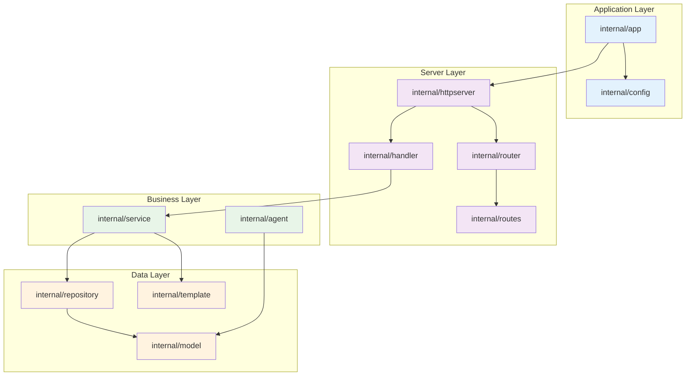
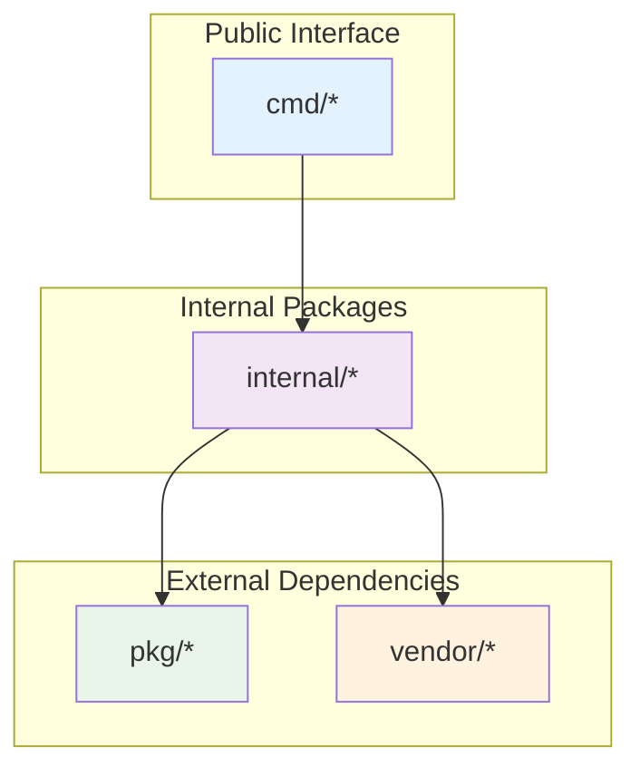

# internal

В этой директории размещается код внутренних модулей приложения. Код внутри этого пакета недоступен для импорта в других приложениях.

Структуру дирктории `internal/` можно разбивать по логическим блокам приложения, выделяя пакеты по функциональному назначению. 
Например, `internal/agent`, `internal/server` и т.д.

Директория `internal/` является специальной в Go и обеспечивает инкапсуляцию кода на уровне модуля. Компилятор Go запрещает импорт пакетов из `internal/` за пределами родительского модуля.

## Архитектура внутренних пакетов

### Иерархия зависимостей

### Принципы организации

- **Инкапсуляция** - код недоступен для внешних импортов
- **Модульность** - каждый пакет отвечает за свою область
- **Зависимости** - четкая иерархия зависимостей
- **Тестируемость** - каждый пакет можно тестировать изолированно
