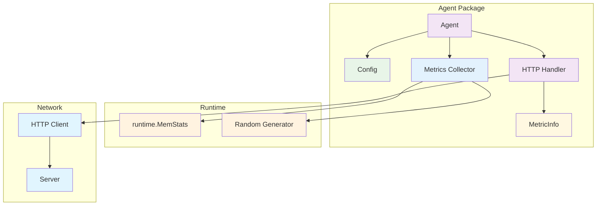
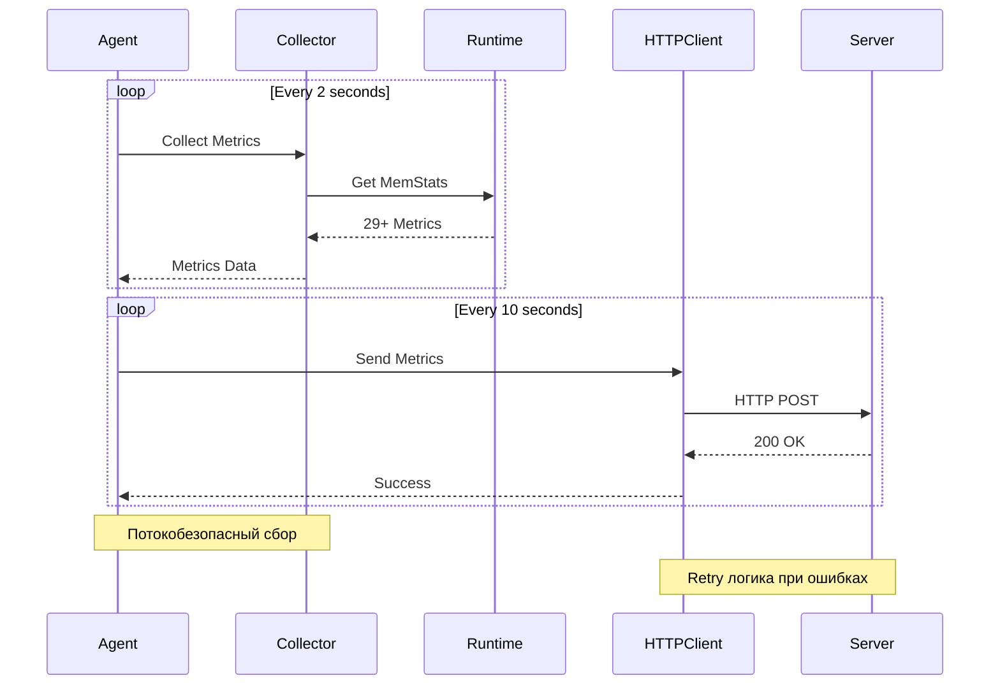

# internal/agent

Агент для сбора и отправки метрик.

## Архитектура агента



### Поток сбора метрик



## Возможности

### ✅ Основные функции
- **Сбор метрик**: 27 runtime метрик + 1 дополнительная (RandomValue) + 1 counter (PollCount)
- **Отправка метрик**: HTTP POST запросы с retry логикой
- **Graceful shutdown**: Корректное завершение работы
- **Потокобезопасность**: Использование `sync.RWMutex`
- **Конфигурация**: Гибкие настройки через структуру Config

### ✅ Обработка ошибок
- **Retry логика**: 2 попытки с задержкой 100ms
- **Детальная диагностика**: Чтение тела ответа при ошибках
- **Логирование ошибок**: Опциональное подробное логирование

### ✅ Конфигурация
- **Валидация**: Проверка корректности настроек
- **Значения по умолчанию**: Готовые к использованию настройки
- **Гибкость**: Поддержка кастомных URL и интервалов

## Структура файлов

### Основные файлы
- `agent.go` - основная логика агента (сбор, отправка, retry логика)
- `config.go` - конфигурация агента с валидацией
- `metrics.go` - работа с метриками (runtime + дополнительные)

### Тестовые файлы
- `agent_test.go` - тесты агента (создание, сбор метрик, потокобезопасность, graceful shutdown, подготовка метрик)
- `config_test.go` - тесты конфигурации (создание, валидация)
- `metrics_test.go` - тесты метрик (создание, заполнение, обновление)

## Запуск тестов

```bash
# Все тесты агента
go test ./internal/agent/... -v

# Только тесты конфигурации
go test ./internal/agent/config_test.go ./internal/agent/config.go -v

# Только тесты агента
go test ./internal/agent/agent_test.go ./internal/agent/agent.go ./internal/agent/config.go ./internal/agent/metrics.go -v

# Только тесты метрик
go test ./internal/agent/metrics_test.go ./internal/agent/metrics.go -v

# Проверка линтером
go vet ./internal/agent/...
```

## Конфигурация по умолчанию

```go
DefaultServerURL      = "http://localhost:8080"
DefaultPollInterval   = 2 * time.Second
DefaultReportInterval = 10 * time.Second
DefaultHTTPTimeout    = 10 * time.Second
DefaultMaxRetries     = 2
DefaultRetryDelay     = 100 * time.Millisecond
```
