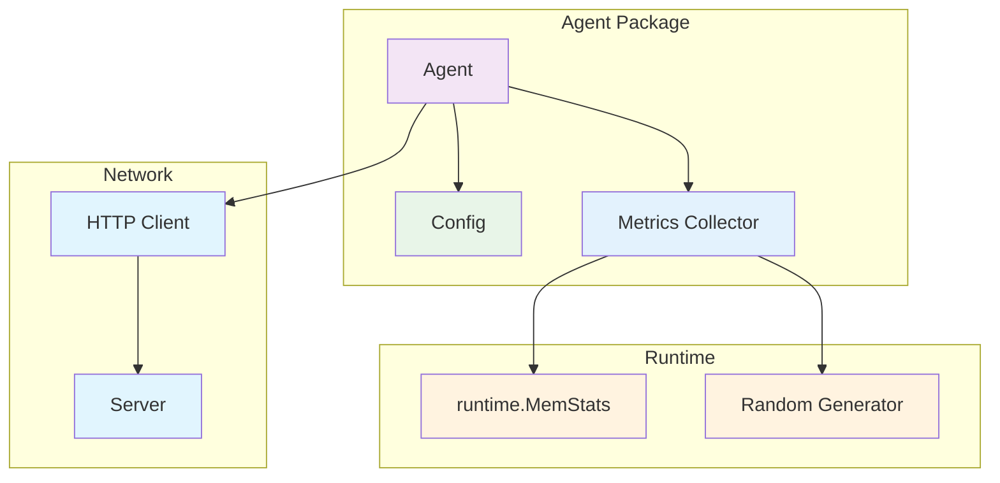
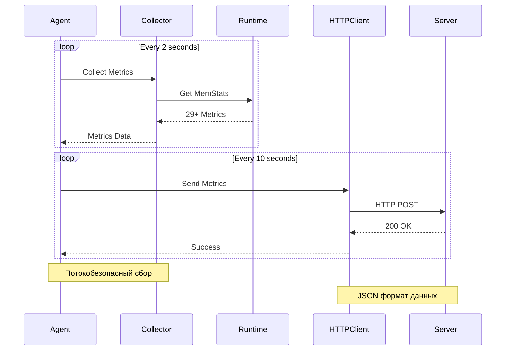

# internal/agent

Агент для сбора и отправки метрик.

## Архитектура агента



### Поток сбора метрик



## Структура файлов

### Основные файлы
- `agent.go` - основная логика агента
- `config.go` - конфигурация агента
- `metrics.go` - работа с метриками

### Тестовые файлы
- `agent_test.go` - тесты агента (создание, сбор метрик, потокобезопасность, graceful shutdown)
- `config_test.go` - тесты конфигурации (создание, валидация)
- `metrics_test.go` - тесты метрик (создание, заполнение, обновление)

## Запуск тестов

```bash
# Все тесты агента
go test ./internal/agent/... -v

# Только тесты конфигурации
go test ./internal/agent/config_test.go ./internal/agent/config.go -v

# Только тесты агента
go test ./internal/agent/agent_test.go ./internal/agent/agent.go ./internal/agent/config.go ./internal/agent/metrics.go -v

# Только тесты метрик
go test ./internal/agent/metrics_test.go ./internal/agent/metrics.go -v
```
