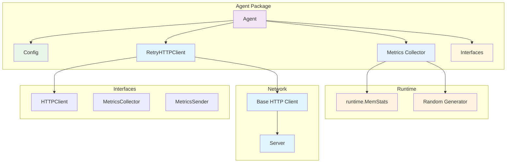
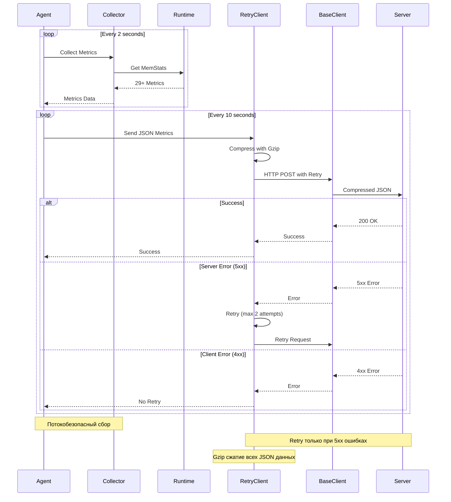

# internal/agent

Агент для сбора и отправки метрик с поддержкой retry логики и gzip сжатия.

## Архитектура агента



### Поток сбора метрик



## Возможности

### ✅ Основные функции
- **Сбор метрик**: 27 runtime метрик + 1 дополнительная (RandomValue) + 1 counter (PollCount)
- **Отправка метрик**: HTTP POST запросы с retry логикой (только JSON API)
- **Graceful shutdown**: Корректное завершение работы
- **Потокобезопасность**: Использование `sync.RWMutex`
- **Конфигурация**: Гибкие настройки через структуру Config
- **Логирование**: Структурированное логирование через logger абстракцию
- **JSON API поддержка**: Отправка метрик через JSON эндпоинты
- **Gzip поддержка**: Автоматическое сжатие всех отправляемых данных
- **Интерфейсы**: Модульная архитектура с интерфейсами для тестируемости
- **Retry HTTP Client**: Отдельный компонент с умной retry логикой

### ✅ Обработка ошибок
- **Умная retry логика**: 2 попытки с задержкой 100ms только при 5xx ошибках
- **Нет retry при 4xx**: Клиентские ошибки не вызывают повторные попытки
- **Создание нового запроса**: Каждая попытка использует свежий HTTP запрос
- **Детальная диагностика**: Чтение тела ответа при ошибках с правильной обработкой EOF
- **Структурированное логирование**: Детальное логирование операций и ошибок
- **Правильное закрытие ресурсов**: Нет утечек HTTP соединений

### ✅ Конфигурация
- **Валидация**: Проверка корректности настроек
- **Значения по умолчанию**: Готовые к использованию настройки
- **Гибкость**: Поддержка кастомных URL и интервалов

### ✅ Gzip поддержка
- **Автоматическое сжатие**: Все JSON метрики автоматически сжимаются перед отправкой
- **HTTP заголовки**: Автоматически устанавливаются `Content-Encoding: gzip` и `Accept-Encoding: gzip`
- **Прозрачная работа**: Сжатие происходит автоматически без изменения API
- **Эффективность**: Значительное уменьшение размера передаваемых данных

### ✅ Архитектурные улучшения
- **Интерфейсы**: `HTTPClient`, `MetricsCollector`, `MetricsSender` для тестируемости
- **Разделение ответственности**: `RetryHTTPClient` отделен от основной логики агента

## Структура файлов

### Основные файлы
- `agent.go` - основная логика агента (сбор, отправка метрик)
- `config.go` - конфигурация агента с валидацией
- `metrics.go` - работа с метриками (runtime + дополнительные)
- `http_client.go` - HTTP клиент с retry логикой
- `metrics_interfaces.go` - интерфейсы для модульной архитектуры

### Тестовые файлы
- `agent_test.go` - тесты агента (создание, сбор метрик, потокобезопасность, graceful shutdown, подготовка JSON)
- `config_test.go` - тесты конфигурации (создание, валидация)
- `metrics_test.go` - тесты метрик (создание, заполнение, обновление)
- `gzip_test.go` - тесты gzip функциональности (сжатие, распаковка, интеграция)
- `http_client_test.go` - тесты HTTP клиента (retry логика, обработка ошибок, helper функции)

## Запуск тестов

```bash
# Все тесты агента
go test ./internal/agent/... -v

# Только тесты конфигурации
go test ./internal/agent/config_test.go ./internal/agent/config.go -v

# Только тесты агента
go test ./internal/agent/agent_test.go ./internal/agent/agent.go ./internal/agent/config.go ./internal/agent/metrics.go -v

# Только тесты метрик
go test ./internal/agent/metrics_test.go ./internal/agent/metrics.go -v

# Проверка линтером
go vet ./internal/agent/...

# Тесты gzip функциональности
go test ./internal/agent/... -run TestAgent_CompressData -v
go test ./internal/agent/... -run TestAgent_CompressDataIntegration -v

# Тесты HTTP клиента с retry логикой
go test ./internal/agent/... -run TestRetryHTTPClient -v

# Тесты с helper функциями
go test ./internal/agent/... -run TestRetryHTTPClient_Do_Success -v
```

## Конфигурация по умолчанию

```go
DefaultServerURL      = "http://localhost:8080"
DefaultPollInterval   = 2 * time.Second
DefaultReportInterval = 10 * time.Second
DefaultHTTPTimeout    = 10 * time.Second
DefaultMaxRetries     = 2
DefaultRetryDelay     = 100 * time.Millisecond
```

## Интерфейсы

### HTTPClient
```go
type HTTPClient interface {
    Do(req *http.Request) (*http.Response, error)
    Post(url, contentType string, body io.Reader) (*http.Response, error)
}
```

### MetricsCollector
```go
type MetricsCollector interface {
    Collect() map[string]any
    GetAllMetrics() map[string]any
}
```

### MetricsSender
```go
type MetricsSender interface {
    Send(metrics map[string]any) error
    SendSingle(name string, value interface{}) error
}
```

## Логирование

Агент использует структурированное логирование для отслеживания всех операций:

```go
// Создание агента с логгером
agentLogger := logger.NewSlogLogger()
agent := agent.NewAgent(config, agentLogger)

// Логирование сбора метрик
agent.collectMetrics()
// Логи: "collected metrics" total=29 gauges=28 counters=1

// Логирование отправки метрик
agent.sendMetrics()
// Логи: "successfully sent metrics" count=29

// Логирование ошибок (при verbose режиме)
// Логи: "error sending metric" name=Alloc error="connection refused"

// Логирование retry логики
// Логи: "failed to read response body" error="network timeout"
// Логи: "server error after 2 attempts: status 500: internal server error"

// Логирование graceful shutdown
agent.Stop()
// Логи: "stopping agent"
// Логи: "polling stopped"  
// Логи: "reporting stopped"
// Логи: "agent stopped gracefully"
```

### Уровни логирования

- **Debug**: Детальная информация о метриках (при verbose режиме)
- **Info**: Основные события (сбор метрик, отправка, остановка)
- **Warn**: Предупреждения (частичные ошибки отправки, ошибки чтения ответов)
- **Error**: Ошибки отправки метрик (при verbose режиме)

## Примеры использования

### Создание агента с кастомным HTTP клиентом
```go
// Создание базового HTTP клиента
baseClient := &http.Client{
    Timeout: 30 * time.Second,
}

// Создание retry клиента
retryClient := NewRetryHTTPClient(baseClient, 3, 200*time.Millisecond, logger)

// Создание агента
config := NewConfig()
agent := &Agent{
    config:     config,
    metrics:    NewMetrics(),
    httpClient: retryClient,
    logger:     logger,
}
```

### Тестирование с моком
```go
// Создание мок HTTP клиента
mockClient := &MockHTTPClient{}
mockClient.SetResponses([]*http.Response{successResp}, []error{nil})

// Создание агента с моком
agent := NewAgent(config, logger)
agent.httpClient = mockClient
```
