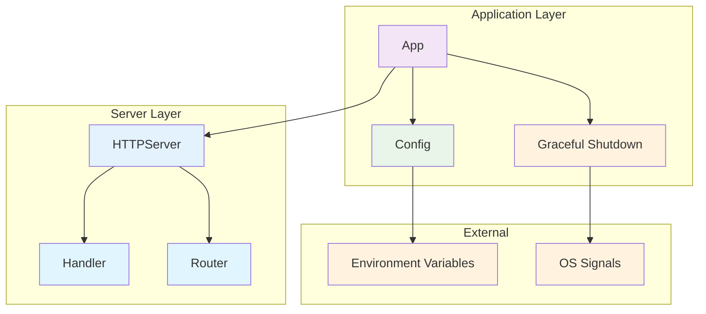
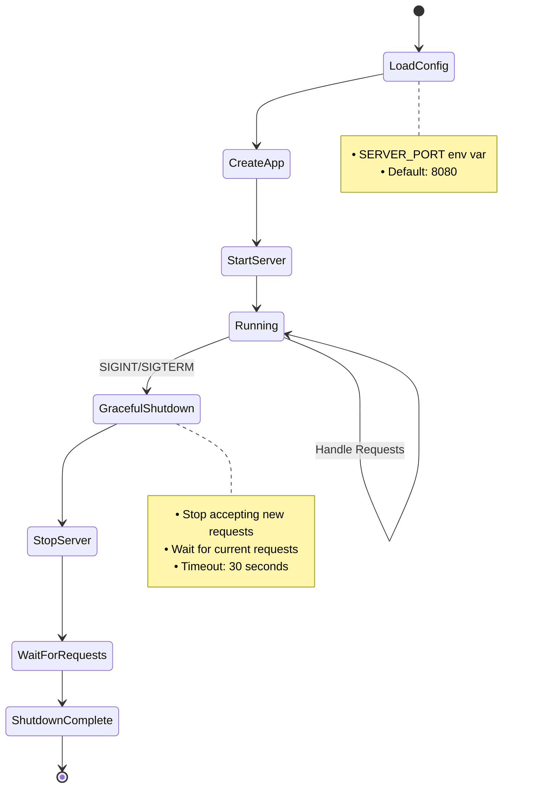

# Пакет `app`

Пакет `app` предоставляет основную логику инициализации и запуска приложения метрик.

## Назначение

Пакет инкапсулирует всю логику запуска приложения, включая:
- Загрузку конфигурации из переменных окружения
- Создание и запуск HTTP сервера
- Graceful shutdown при получении сигналов
- Обработку ошибок и логирование

## Компоненты

### `App`
Основная структура приложения, которая управляет жизненным циклом сервера.

```go
type App struct {
    server *httpserver.Server
    port   string
}
```

### Архитектура приложения



### Жизненный цикл приложения



### `Config`
Конфигурация приложения.

```go
type Config struct {
    Port string
}
```

## Основные методы

### `New(config Config) *App`
Создает новое приложение с заданной конфигурацией.

### `Run() error`
Запускает приложение и ожидает сигналы для graceful shutdown.

### `LoadConfig() Config`
Загружает конфигурацию из переменных окружения.

## Переменные окружения

- `SERVER_PORT` - порт для запуска сервера (по умолчанию: "8080")

## Пример использования

```go
package main

import (
    "log"
    "github.com/IgorKilipenko/metrical/internal/app"
)

func main() {
    // Загружаем конфигурацию
    config := app.LoadConfig()
    
    // Создаем приложение
    application := app.New(config)
    
    // Запускаем приложение
    if err := application.Run(); err != nil {
        log.Fatal(err)
    }
}
```

## Graceful Shutdown

Приложение корректно обрабатывает сигналы:
- `SIGINT` (Ctrl+C)
- `SIGTERM`

При получении сигнала приложение:
1. Логирует получение сигнала
2. Останавливает прием новых запросов
3. Ждет завершения текущих запросов (до 30 секунд)
4. Корректно завершает работу

## Тестирование

Пакет включает полное покрытие тестами:
- Загрузка конфигурации
- Создание приложения
- Обработка переменных окружения

Запуск тестов:
```bash
go test -v ./internal/app
```

## Преимущества

1. **Разделение ответственности** - логика инициализации отделена от main
2. **Тестируемость** - легко тестировать компоненты изолированно
3. **Конфигурируемость** - гибкая настройка через переменные окружения
4. **Надежность** - graceful shutdown для корректного завершения
5. **Переиспользование** - можно использовать в разных точках входа
