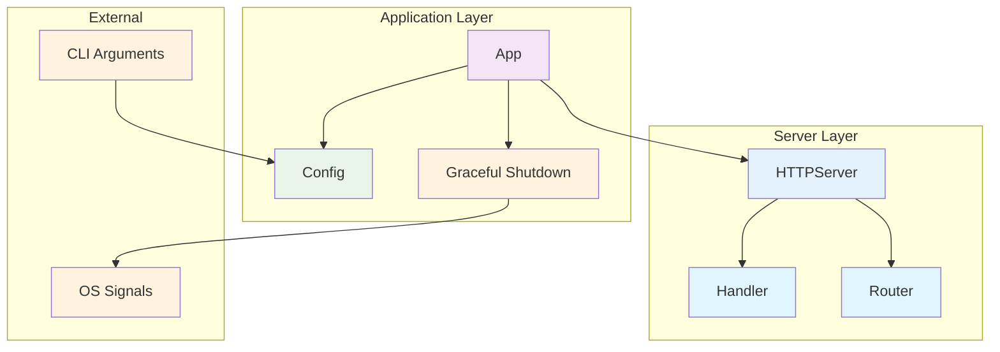
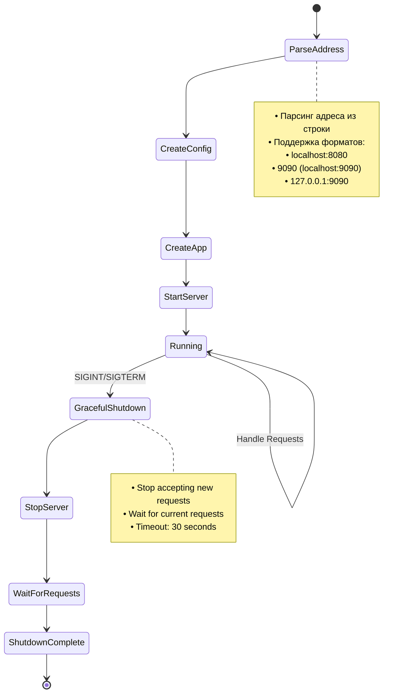

# Пакет `app`

Пакет `app` предоставляет основную логику инициализации и запуска приложения метрик.

## Назначение

Пакет инкапсулирует всю логику запуска приложения, включая:
- Создание конфигурации из строки адреса
- Создание и запуск HTTP сервера
- Graceful shutdown при получении сигналов
- Обработку ошибок и логирование

## Компоненты

### `App`
Основная структура приложения, которая управляет жизненным циклом сервера.

```go
type App struct {
    server *httpserver.Server
    addr   string
}
```

### `Config`
Конфигурация приложения.

```go
type Config struct {
    Addr string // Адрес сервера (например, "localhost")
    Port string // Порт сервера (например, "8080")
}
```

### Архитектура приложения



### Жизненный цикл приложения



## Основные методы

### `NewConfig(addr string) (Config, error)`
Создает конфигурацию из строки адреса. Поддерживает различные форматы:
- `localhost:8080` - полный адрес
- `9090` - только порт (хост по умолчанию: localhost)
- `127.0.0.1:9090` - IP адрес с портом

### `New(config Config) *App`
Создает новое приложение с заданной конфигурацией.

### `Run() error`
Запускает приложение и ожидает сигналы для graceful shutdown.

## Пример использования

```go
package main

import (
    "log"
    "github.com/IgorKilipenko/metrical/internal/app"
)

func main() {
    // Создаем конфигурацию из строки адреса
    config, err := app.NewConfig("localhost:8080")
    if err != nil {
        log.Fatal(err)
    }
    
    // Создаем приложение
    application := app.New(config)
    
    // Запускаем приложение
    if err := application.Run(); err != nil {
        log.Fatal(err)
    }
}
```

## Graceful Shutdown

Приложение корректно обрабатывает сигналы:
- `SIGINT` (Ctrl+C)
- `SIGTERM`

При получении сигнала приложение:
1. Логирует получение сигнала
2. Останавливает прием новых запросов
3. Ждет завершения текущих запросов (до 30 секунд)
4. Корректно завершает работу

## Тестирование

Пакет включает полное покрытие тестами:
- Создание конфигурации из различных форматов адреса
- Парсинг адреса и порта
- Создание приложения
- Получение адреса приложения

Запуск тестов:
```bash
go test -v ./internal/app
```

## Преимущества

1. **Разделение ответственности** - логика инициализации отделена от CLI
2. **Тестируемость** - легко тестировать компоненты изолированно
3. **Конфигурируемость** - гибкая настройка через строку адреса
4. **Надежность** - graceful shutdown для корректного завершения
5. **Переиспользование** - можно использовать в разных точках входа
6. **Чистая архитектура** - CLI логика находится в транспортном слое
