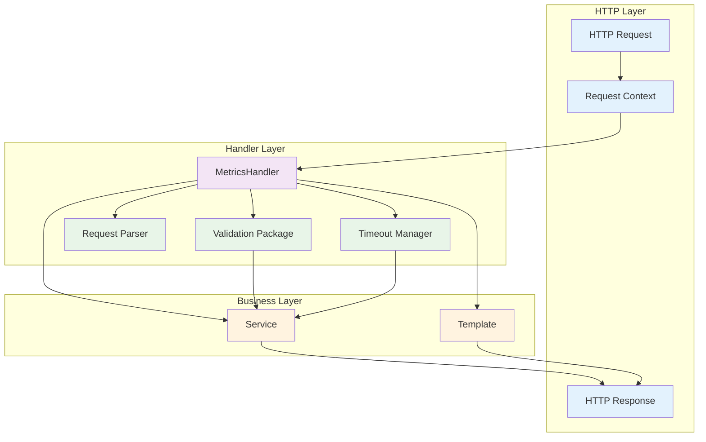
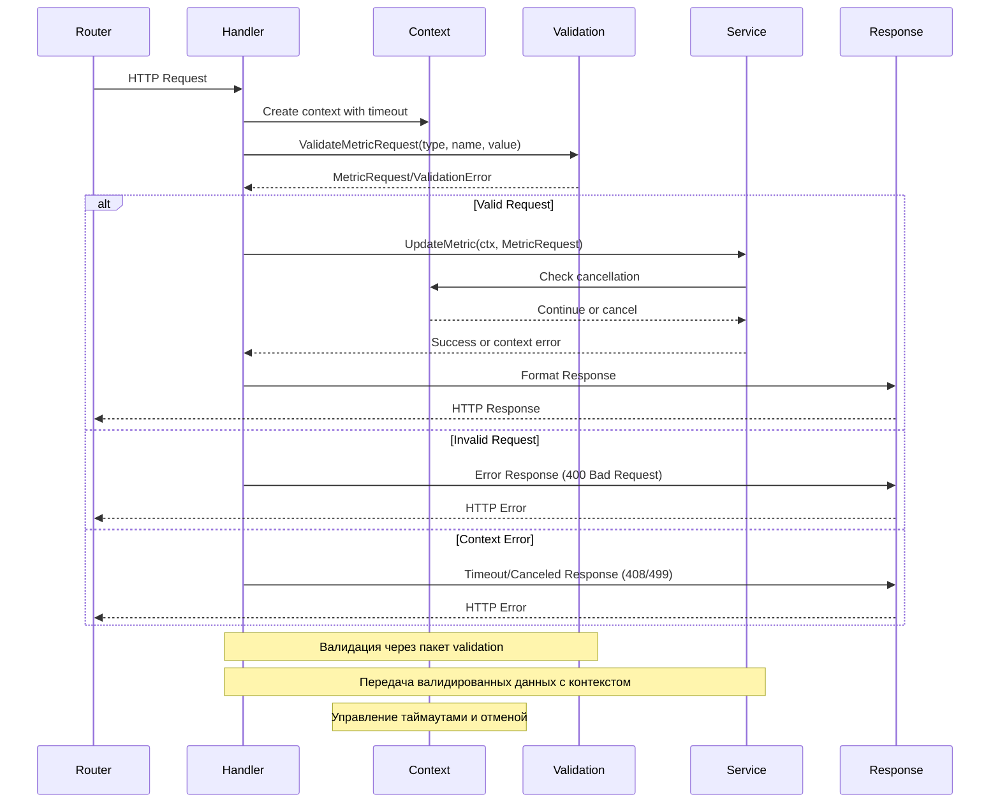

# internal/handler

Пакет для обработки HTTP-запросов. Содержит адаптеры между HTTP-транспортом и бизнес-логикой приложения.

## Назначение

- Обработка HTTP-запросов
- Валидация входных данных через пакет `validation`
- Вызовы сервисов с бизнес-логикой и контекстом
- Формирование HTTP-ответов
- Управление таймаутами и отменой операций

## Архитектура обработчиков



### Поток обработки запроса с контекстом



## Компоненты

### MetricsHandler

Основной обработчик для работы с метриками с поддержкой контекста:

```go
type MetricsHandler struct {
    service  *service.MetricsService
    template *template.MetricsTemplate
}
```

### Основные методы

- `UpdateMetric(w, r)` - обновление метрики с валидацией и контекстом
- `GetMetricValue(w, r)` - получение значения метрики с контекстом
- `GetAllMetrics(w, r)` - получение всех метрик (HTML) с контекстом
- `getAllMetricsData(ctx)` - приватный метод для получения данных метрик с контекстом

## Принципы

- **Адаптер** - преобразует HTTP в вызовы сервисов
- **Валидация** - использует пакет `validation` для проверки входных данных
- **Контекст** - управляет таймаутами и отменой операций
- **Обработка ошибок** - возвращает соответствующие HTTP коды
- **Разделение ответственности** - только HTTP логика, без бизнес-логики
- **Типобезопасность** - передача валидированных структур в сервисы
- **Graceful handling** - корректная обработка отмены запросов

## Использование контекста

### Создание контекста с таймаутом

```go
func (h *MetricsHandler) UpdateMetric(w http.ResponseWriter, r *http.Request) {
    // Создаем контекст с таймаутом для операции
    ctx, cancel := context.WithTimeout(r.Context(), 5*time.Second)
    defer cancel()

    // Валидация и вызов сервиса с контекстом
    metricReq, err := validation.ValidateMetricRequest(metricType, metricName, metricValue)
    if err != nil {
        http.Error(w, err.Error(), http.StatusBadRequest)
        return
    }

    err = h.service.UpdateMetric(ctx, metricReq)
    if err != nil {
        // Обработка ошибок контекста
        if err == context.DeadlineExceeded {
            http.Error(w, "Request timeout", http.StatusRequestTimeout)
        } else if err == context.Canceled {
            http.Error(w, "Request canceled", http.StatusRequestTimeout)
        } else {
            http.Error(w, "Internal server error", http.StatusInternalServerError)
        }
        return
    }

    w.WriteHeader(http.StatusOK)
}
```

### Различные типы контекстов

```go
// Для операций обновления - короткий таймаут
ctx, cancel := context.WithTimeout(r.Context(), 5*time.Second)
defer cancel()

// Для операций чтения - средний таймаут
ctx, cancel := context.WithTimeout(r.Context(), 10*time.Second)
defer cancel()

// Для получения всех метрик - длинный таймаут
ctx, cancel := context.WithTimeout(r.Context(), 30*time.Second)
defer cancel()
```

### Обработка ошибок контекста

```go
func handleContextError(err error, w http.ResponseWriter) {
    switch err {
    case context.DeadlineExceeded:
        http.Error(w, "Request timeout", http.StatusRequestTimeout)
    case context.Canceled:
        http.Error(w, "Request canceled", http.StatusRequestTimeout)
    default:
        http.Error(w, "Internal server error", http.StatusInternalServerError)
    }
}
```

## Преимущества использования контекста

1. **Таймауты** - предотвращение зависания операций
2. **Отмена** - возможность отменить длительные операции
3. **Graceful shutdown** - корректное завершение при остановке сервера
4. **Ресурсосбережение** - освобождение ресурсов при отмене
5. **Пользовательский опыт** - быстрая обратная связь при таймаутах
6. **Мониторинг** - возможность отслеживать время выполнения операций

## Тестирование

```bash
go test -v ./internal/handler
```

### Тестирование с контекстом

```go
func TestMetricsHandler_UpdateMetric_WithContext(t *testing.T) {
    // Создаем мок сервиса
    mockService := &MockMetricsService{}
    
    // Создаем хендлер
    handler := &MetricsHandler{
        service: mockService,
    }
    
    // Создаем запрос с контекстом
    req := httptest.NewRequest("POST", "/update/gauge/test/23.5", nil)
    w := httptest.NewRecorder()
    
    // Настраиваем ожидания
    mockService.On("UpdateMetric", mock.Anything, mock.Anything).Return(nil)
    
    // Вызываем хендлер
    handler.UpdateMetric(w, req)
    
    // Проверяем результат
    assert.Equal(t, http.StatusOK, w.Code)
    mockService.AssertExpectations(t)
}
```