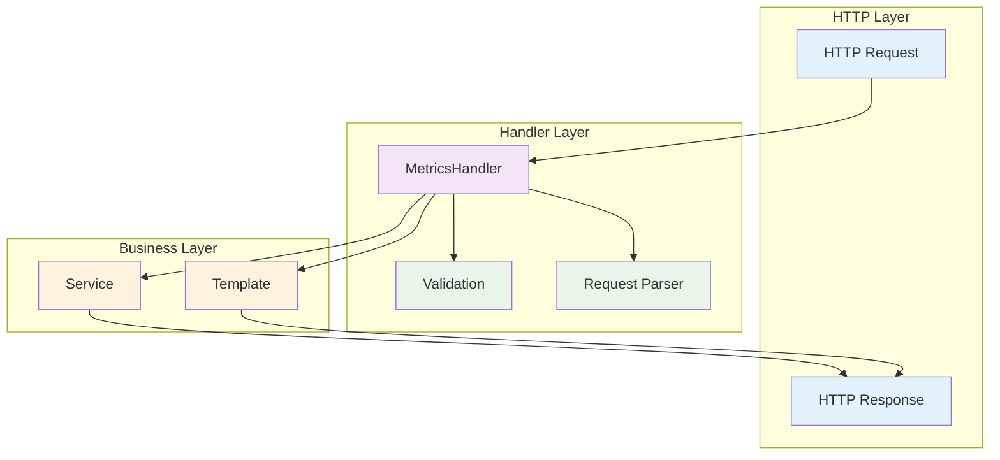
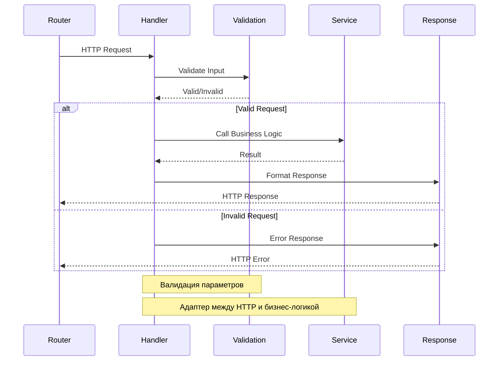

# internal/handler

В этом пакете размещаются обработчики HTTP-запросов. Здесь инкапсулируется так называемая логика представления.

Обычно хэндлеры реализуют:
- логику обработки запросов
- валидацию данных
- вызовы сервисов, в которых содержится бизнес-логика приложения
- формирование HTTP-ответов

Рекомендуется разбивать хэндлеры по функциональным группам и следовать принципу, где хэндлеры являются адаптерами между HTTP-транспортом и бизнес-логикой приложения.

## Архитектура обработчиков



### Поток обработки запроса



## Компоненты

### MetricsHandler

Основной обработчик для работы с метриками:

```go
type MetricsHandler struct {
    service *service.MetricsService
    template *template.MetricsTemplate
}
```

### Основные методы

- `UpdateMetric(w, r)` - обновление метрики
- `GetMetricValue(w, r)` - получение значения метрики  
- `GetAllMetrics(w, r)` - получение всех метрик (HTML)

## Принципы

- **Адаптер** - преобразует HTTP в вызовы сервисов
- **Валидация** - проверяет корректность входных данных
- **Обработка ошибок** - возвращает соответствующие HTTP коды
- **Разделение ответственности** - только HTTP логика, без бизнес-логики