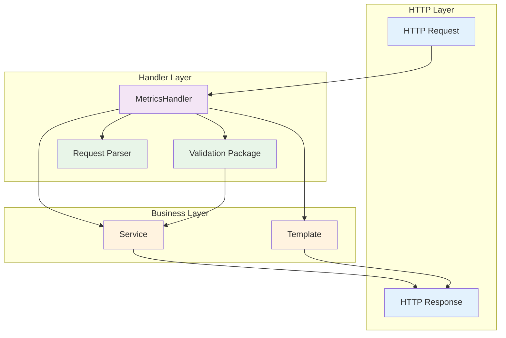
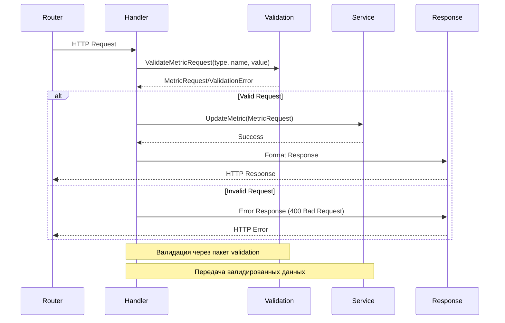

# internal/handler

Пакет для обработки HTTP-запросов. Содержит адаптеры между HTTP-транспортом и бизнес-логикой приложения.

## Назначение

- Обработка HTTP-запросов
- Валидация входных данных через пакет `validation`
- Вызовы сервисов с бизнес-логикой
- Формирование HTTP-ответов

## Архитектура обработчиков



### Поток обработки запроса



## Компоненты

### MetricsHandler

Основной обработчик для работы с метриками:

```go
type MetricsHandler struct {
    service  *service.MetricsService
    template *template.MetricsTemplate
}
```

### Основные методы

- `UpdateMetric(w, r)` - обновление метрики с валидацией
- `GetMetricValue(w, r)` - получение значения метрики  
- `GetAllMetrics(w, r)` - получение всех метрик (HTML)
- `getAllMetricsData()` - приватный метод для получения данных метрик

## Принципы

- **Адаптер** - преобразует HTTP в вызовы сервисов
- **Валидация** - использует пакет `validation` для проверки входных данных
- **Обработка ошибок** - возвращает соответствующие HTTP коды
- **Разделение ответственности** - только HTTP логика, без бизнес-логики
- **Типобезопасность** - передача валидированных структур в сервисы