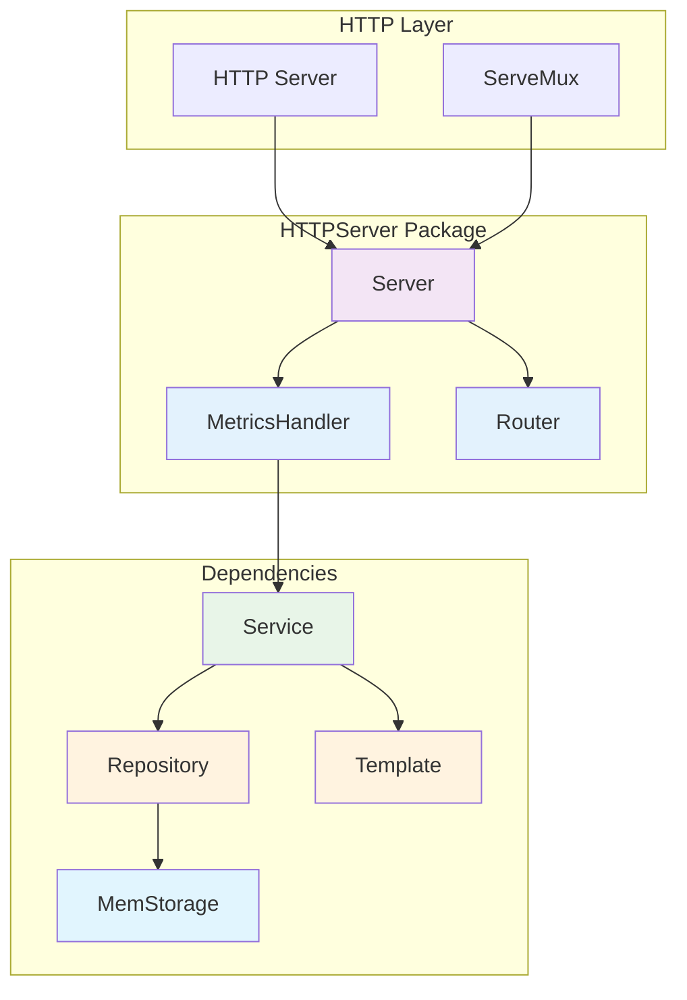
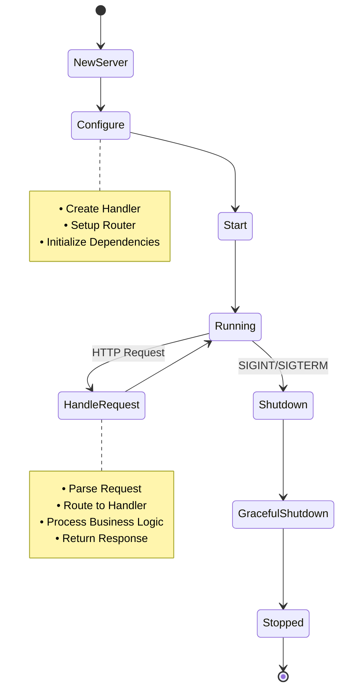

# HTTPServer Package

Пакет `httpserver` содержит логику HTTP сервера для работы с метриками.

## Описание

Пакет предоставляет структуру `Server`, которая инкапсулирует всю логику HTTP сервера, включая:
- Создание и настройку хранилища метрик
- Инициализацию сервисов и обработчиков
- Настройку маршрутов HTTP
- Запуск сервера

### Архитектура HTTP сервера



### Жизненный цикл сервера



## Использование

```go
// Создание сервера с обработкой ошибок
server, err := httpserver.NewServer(":8080")
if err != nil {
    log.Fatalf("Failed to create server: %v", err)
}

// Запуск сервера
if err := server.Start(); err != nil {
    log.Printf("Server error: %v", err)
}

// Graceful shutdown
ctx, cancel := context.WithTimeout(context.Background(), 30*time.Second)
defer cancel()
if err := server.Shutdown(ctx); err != nil {
    log.Printf("Shutdown error: %v", err)
}
```

## Структуры

### Server

```go
type Server struct {
    addr    string
    handler *handler.MetricsHandler
    router  *router.Router
    server  *http.Server
}
```

- `addr` - адрес для запуска сервера
- `handler` - HTTP обработчик для метрик
- `router` - кэшированный роутер
- `server` - ссылка на HTTP сервер для graceful shutdown

## Методы

### NewServer(addr string) (*Server, error)

Создает новый экземпляр сервера с указанным адресом. Возвращает ошибку при пустом адресе.

### Start() error

Запускает HTTP сервер и блокирует выполнение до завершения работы сервера. Корректно обрабатывает ошибки и логирует их.

### Shutdown(ctx context.Context) error

Gracefully останавливает сервер с использованием переданного контекста. Корректно завершает все текущие запросы.


### ServeHTTP(w http.ResponseWriter, r *http.Request)

Реализует интерфейс `http.Handler`, что позволяет использовать сервер напрямую в тестах.

## Маршруты

- `POST /update/<тип>/<имя>/<значение>` - обновление метрики 