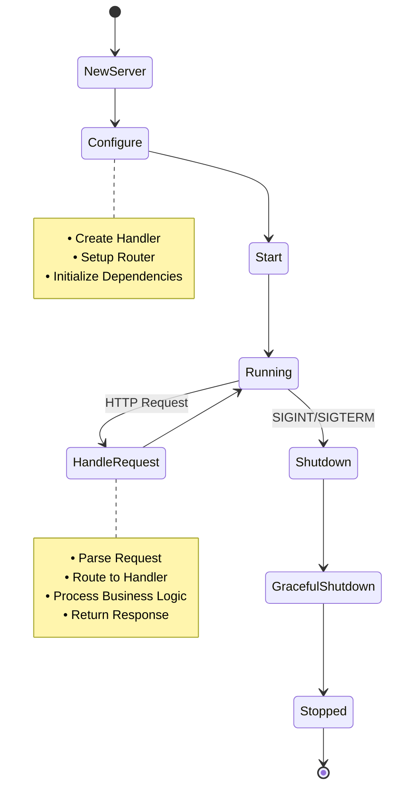

# HTTPServer Package

Пакет `httpserver` содержит логику HTTP сервера для работы с метриками.

## Описание

Пакет предоставляет структуру `Server`, которая инкапсулирует всю логику HTTP сервера, включая:
- Прием HTTP обработчика через Dependency Injection
- Настройку маршрутов HTTP
- Запуск сервера с graceful shutdown
- Обработку ошибок и валидацию входных параметров

### Архитектура HTTP сервера (Clean Architecture)

```mermaid
graph TB
    subgraph "HTTPServer Package"
        SERVER[Server]
        ROUTER[Router]
    end
    
    subgraph "Injected Dependencies"
        HANDLER[MetricsHandler]
    end
    
    subgraph "External Dependencies"
        SERVICE[Service]
        REPO[Repository]
        STORAGE[Storage Interface]
        TEMPLATE[Template]
    end
    
    subgraph "HTTP Layer"
        HTTP_SERVER[HTTP Server]
    end
    
    SERVER -.->|Dependency Injection| HANDLER
    SERVER --> ROUTER
    HANDLER --> SERVICE
    SERVICE --> REPO
    REPO --> STORAGE
    SERVICE --> TEMPLATE
    
    HTTP_SERVER --> SERVER
    
    style SERVER fill:#f3e5f5
    style HANDLER fill:#e3f2fd
    style ROUTER fill:#e3f2fd
    style SERVICE fill:#e8f5e8
    style REPO fill:#fff3e0
    style STORAGE fill:#e1f5fe
    style TEMPLATE fill:#fff3e0
    
    note right of SERVER
        • Принимает handler через DI
        • Не создает зависимости
        • Следует принципам Clean Architecture
    end note
```

### Жизненный цикл сервера



## Использование

### Создание сервера с Dependency Injection

```go
// Создание зависимостей (на уровне приложения)
storage := models.NewMemStorage()
repo := repository.NewInMemoryMetricsRepository(storage)
service := service.NewMetricsService(repo)
handler := handler.NewMetricsHandler(service)

// Создание сервера с переданными зависимостями
server, err := httpserver.NewServer(":8080", handler)
if err != nil {
    log.Fatalf("Failed to create server: %v", err)
}

// Запуск сервера
if err := server.Start(); err != nil {
    log.Printf("Server error: %v", err)
}

// Graceful shutdown
ctx, cancel := context.WithTimeout(context.Background(), 30*time.Second)
defer cancel()
if err := server.Shutdown(ctx); err != nil {
    log.Printf("Shutdown error: %v", err)
}
```

### Использование в тестах

```go
// Создание mock handler для тестов
mockHandler := &MockMetricsHandler{}

server, err := httpserver.NewServer(":8080", mockHandler)
if err != nil {
    t.Fatalf("Failed to create server: %v", err)
}
```

## Структуры

### Server

```go
type Server struct {
    addr    string
    handler *handler.MetricsHandler
    router  *router.Router
    server  *http.Server
}
```

- `addr` - адрес для запуска сервера
- `handler` - HTTP обработчик для метрик
- `router` - кэшированный роутер
- `server` - ссылка на HTTP сервер для graceful shutdown

## Методы

### NewServer(addr string, handler *handler.MetricsHandler) (*Server, error)

Создает новый экземпляр сервера с указанным адресом и HTTP обработчиком. 
Возвращает ошибку при пустом адресе или nil handler.

**Параметры:**
- `addr` - адрес для запуска сервера (например, ":8080")
- `handler` - HTTP обработчик для метрик (не может быть nil)

**Возвращает:**
- `*Server` - экземпляр сервера
- `error` - ошибка валидации или nil

### Start() error

Запускает HTTP сервер и блокирует выполнение до завершения работы сервера. Корректно обрабатывает ошибки и логирует их.

### Shutdown(ctx context.Context) error

Gracefully останавливает сервер с использованием переданного контекста. 
Корректно завершает все текущие запросы в рамках таймаута контекста.

**Параметры:**
- `ctx` - контекст с таймаутом для graceful shutdown

**Возвращает:**
- `error` - ошибка shutdown или nil


### ServeHTTP(w http.ResponseWriter, r *http.Request)

Реализует интерфейс `http.Handler`, что позволяет использовать сервер напрямую в тестах.

## 🏗️ Архитектурные принципы

### Dependency Injection
- ✅ **Инверсия зависимостей** - сервер принимает handler через конструктор
- ✅ **Отсутствие прямых зависимостей** - сервер не создает конкретные реализации
- ✅ **Тестируемость** - легко подменить handler на mock в тестах

### Clean Architecture
- ✅ **Разделение слоев** - HTTP слой отделен от бизнес-логики
- ✅ **Интерфейсы** - сервер работает только с интерфейсами
- ✅ **Направление зависимостей** - зависимости направлены внутрь

### Error Handling
- ✅ **Валидация входных параметров** - проверка addr и handler
- ✅ **Контекстные ошибки** - детальные сообщения об ошибках
- ✅ **Graceful shutdown** - корректная остановка сервера

### Single Responsibility
- ✅ **Единственная ответственность** - сервер отвечает только за HTTP
- ✅ **Композиция** - делегирует обработку handler'у
- ✅ **Инкапсуляция** - скрывает детали реализации

## Маршруты

- `POST /update/<тип>/<имя>/<значение>` - обновление метрики

## 📋 Changelog

### v2.0.0 (Текущая версия)
- ✨ **Dependency Injection** - сервер принимает handler через конструктор
- ✨ **Clean Architecture** - убрана прямая зависимость от конкретных реализаций
- ✨ **Улучшенная валидация** - проверка handler на nil
- 🧹 **Очистка API** - удален метод `NewServerWithDefaults`
- 📚 **Обновленная документация** - актуальные примеры использования

### v1.0.0
- 🎉 **Первоначальный релиз** - базовая функциональность HTTP сервера
- 🌐 **HTTP API** - обработка запросов метрик
- 🔄 **Graceful Shutdown** - корректная остановка сервера
- 🧪 **Тестирование** - полное покрытие тестами 