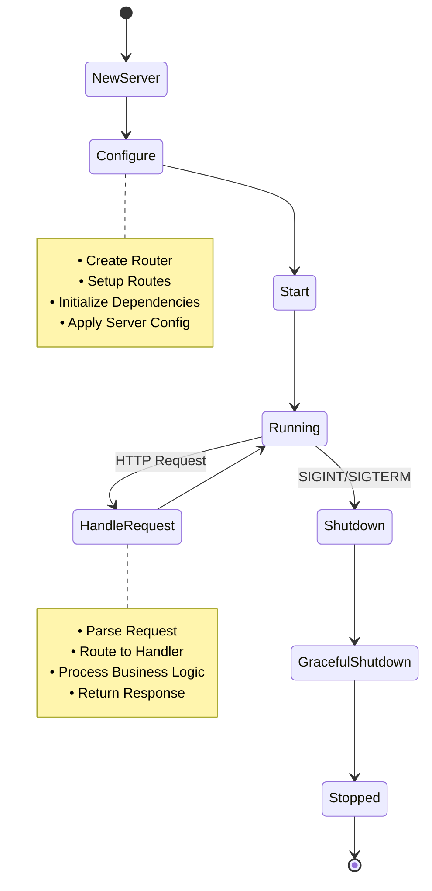

# HTTPServer Package

Пакет `httpserver` содержит логику HTTP сервера для работы с метриками.

## Описание

Пакет предоставляет структуру `Server`, которая инкапсулирует всю логику HTTP сервера, включая:
- Прием HTTP обработчика через Dependency Injection
- Настройку маршрутов HTTP
- Запуск сервера с graceful shutdown
- Обработку ошибок и валидацию входных параметров
- Структурированное логирование с использованием `slog`
- Гибкую конфигурацию сервера

### Архитектура HTTP сервера (Clean Architecture)

```mermaid
graph TB
    subgraph "HTTPServer Package"
        SERVER[Server]
        ROUTER[Router]
        CONFIG[ServerConfig]
    end
    
    subgraph "Injected Dependencies"
        HANDLER[MetricsHandler]
    end
    
    subgraph "Business Logic Layer"
        SERVICE[Service]
        TEMPLATE[Template]
    end
    
    subgraph "Data Access Layer"
        REPO[Repository Interface]
        IMR[InMemory Repository]
    end
    
    subgraph "Data Models"
        MODELS[Models]
    end
    
    subgraph "HTTP Layer"
        HTTP_SERVER[HTTP Server]
    end
    
    SERVER -.->|Dependency Injection| HANDLER
    SERVER --> ROUTER
    SERVER --> CONFIG
    HANDLER --> SERVICE
    SERVICE --> REPO
    REPO --> IMR
    IMR --> MODELS
    SERVICE --> TEMPLATE
    
    HTTP_SERVER --> SERVER
    
    style SERVER fill:#f3e5f5
    style HANDLER fill:#e3f2fd
    style ROUTER fill:#e3f2fd
    style CONFIG fill:#fff3e0
    style SERVICE fill:#e8f5e8
    style REPO fill:#fff3e0
    style IMR fill:#fff3e0
    style MODELS fill:#e1f5fe
    style TEMPLATE fill:#fff3e0
    
    note right of SERVER
        • Принимает handler через DI
        • Не создает зависимости
        • Следует принципам Clean Architecture
        • Структурированное логирование
        • Гибкая конфигурация
    end note
```

### Жизненный цикл сервера



## Использование

### Создание сервера с Dependency Injection

```go
// Создание зависимостей (на уровне приложения)
repository := repository.NewInMemoryMetricsRepository()
service := service.NewMetricsService(repository)
handler := handler.NewMetricsHandler(service)

// Создание сервера с переданными зависимостями
server, err := httpserver.NewServer(":8080", handler)
if err != nil {
    log.Fatalf("Failed to create server: %v", err)
}

// Запуск сервера
if err := server.Start(); err != nil {
    log.Printf("Server error: %v", err)
}

// Graceful shutdown
ctx, cancel := context.WithTimeout(context.Background(), 30*time.Second)
defer cancel()
if err := server.Shutdown(ctx); err != nil {
    log.Printf("Shutdown error: %v", err)
}
```

### Создание сервера с кастомной конфигурацией

```go
// Создание кастомной конфигурации
config := &httpserver.ServerConfig{
    Addr:         ":9090",
    ReadTimeout:  15 * time.Second,
    WriteTimeout: 15 * time.Second,
    IdleTimeout:  30 * time.Second,
}

// Создание сервера с конфигурацией
server, err := httpserver.NewServerWithConfig(config, handler)
if err != nil {
    log.Fatalf("Failed to create server: %v", err)
}
```

### Использование конфигурации по умолчанию

```go
// Получение конфигурации по умолчанию
config := httpserver.DefaultServerConfig()
config.Addr = ":8080" // Переопределяем адрес

server, err := httpserver.NewServerWithConfig(config, handler)
```

### Использование в тестах

```go
// Создание test handler для тестов
repository := repository.NewInMemoryMetricsRepository()
service := service.NewMetricsService(repository)
handler := handler.NewMetricsHandler(service)

server, err := httpserver.NewServer(":8080", handler)
if err != nil {
    t.Fatalf("Failed to create server: %v", err)
}
```

## Структуры

### ServerConfig

```go
type ServerConfig struct {
    Addr         string        // Адрес для запуска сервера
    ReadTimeout  time.Duration // Таймаут чтения запроса
    WriteTimeout time.Duration // Таймаут записи ответа
    IdleTimeout  time.Duration // Таймаут простоя соединения
}
```

### Server

```go
type Server struct {
    config  *ServerConfig           // Конфигурация сервера
    handler *handler.MetricsHandler // HTTP обработчик для метрик
    router  *router.Router          // Кэшированный роутер
    server  *http.Server            // Ссылка на HTTP сервер для graceful shutdown
}
```

## Методы

### NewServer(addr string, handler *handler.MetricsHandler) (*Server, error)

Создает новый экземпляр сервера с указанным адресом и HTTP обработчиком. 
Возвращает ошибку при пустом адресе или nil handler.

**Параметры:**
- `addr` - адрес для запуска сервера (например, ":8080")
- `handler` - HTTP обработчик для метрик (не может быть nil)

**Возвращает:**
- `*Server` - экземпляр сервера
- `error` - ошибка валидации или nil

### NewServerWithConfig(config *ServerConfig, handler *handler.MetricsHandler) (*Server, error)

Создает новый экземпляр сервера с кастомной конфигурацией.

**Параметры:**
- `config` - конфигурация сервера (не может быть nil)
- `handler` - HTTP обработчик для метрик (не может быть nil)

**Возвращает:**
- `*Server` - экземпляр сервера
- `error` - ошибка валидации или nil

### DefaultServerConfig() *ServerConfig

Возвращает конфигурацию сервера по умолчанию:
- `Addr`: ":8080"
- `ReadTimeout`: 30 секунд
- `WriteTimeout`: 30 секунд
- `IdleTimeout`: 60 секунд

### Start() error

Запускает HTTP сервер и блокирует выполнение до завершения работы сервера. 
Использует структурированное логирование для записи событий.

### Shutdown(ctx context.Context) error

Gracefully останавливает сервер с использованием переданного контекста. 
Корректно завершает все текущие запросы в рамках таймаута контекста.

**Параметры:**
- `ctx` - контекст с таймаутом для graceful shutdown

**Возвращает:**
- `error` - ошибка shutdown или nil

### ServeHTTP(w http.ResponseWriter, r *http.Request)

Реализует интерфейс `http.Handler`, что позволяет использовать сервер напрямую в тестах.

### createRouter() *router.Router

Создает и настраивает роутер с маршрутами. Использует пакет `routes` для настройки маршрутов.

## 🏗️ Архитектурные принципы

### Dependency Injection
- ✅ **Инверсия зависимостей** - сервер принимает handler через конструктор
- ✅ **Отсутствие прямых зависимостей** - сервер не создает конкретные реализации
- ✅ **Тестируемость** - легко подменить handler на mock в тестах

### Clean Architecture
- ✅ **Разделение слоев** - HTTP слой отделен от бизнес-логики
- ✅ **Интерфейсы** - сервер работает только с интерфейсами
- ✅ **Направление зависимостей** - зависимости направлены внутрь

### Error Handling
- ✅ **Валидация входных параметров** - проверка config и handler
- ✅ **Контекстные ошибки** - детальные сообщения об ошибках
- ✅ **Graceful shutdown** - корректная остановка сервера

### Single Responsibility
- ✅ **Единственная ответственность** - сервер отвечает только за HTTP
- ✅ **Композиция** - делегирует обработку handler'у
- ✅ **Инкапсуляция** - скрывает детали реализации

### Structured Logging
- ✅ **Структурированные логи** - использование `slog` для лучшей читаемости
- ✅ **Контекстная информация** - логи содержат адрес сервера и ошибки
- ✅ **Уровни логирования** - Info для нормальных событий, Error для ошибок

## Маршруты

Сервер поддерживает следующие маршруты:

- `GET /` - отображение всех метрик (HTML)
- `POST /update/{type}/{name}/{value}` - обновление метрики
- `GET /value/{type}/{name}` - получение значения метрики

## Тестирование

Пакет включает интеграционные тесты с **70.8% покрытием**, которые проверяют:
- Создание сервера с валидными параметрами
- Обработку ошибок при невалидных параметрах
- HTTP endpoints и их корректную работу
- Graceful shutdown функциональность
- Работу с конфигурацией сервера
- Edge cases и граничные условия
- Конкурентные запросы
- Валидацию HTTP методов

