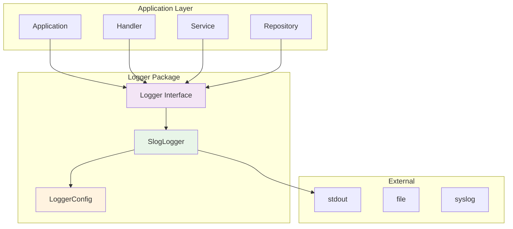

# Logger Package

Пакет `logger` предоставляет абстракцию для логирования с поддержкой различных уровней и структурированного логирования.

## Описание

Пакет инкапсулирует логику логирования и предоставляет единый интерфейс для всех компонентов приложения. Основная цель - обеспечить консистентное логирование с возможностью легкого переключения между различными реализациями.

## Компоненты

### Logger Interface

Основной интерфейс для логирования:

```go
type Logger interface {
    // Уровни логирования
    SetLevel(level LogLevel)
    Debug(msg string, args ...any)
    Info(msg string, args ...any)
    Warn(msg string, args ...any)
    Error(msg string, args ...any)

    // Контекст и поля
    WithContext(ctx context.Context) Logger
    WithFields(fields map[string]any) Logger

    // Утилиты
    Sync() error
}
```

### LogLevel

Уровни логирования:

```go
type LogLevel int

const (
    DebugLevel LogLevel = iota
    InfoLevel
    WarnLevel
    ErrorLevel
)
```

### SlogLogger

Реализация логгера на основе стандартного пакета `slog`:

```go
type SlogLogger struct {
    logger *slog.Logger
    level  LogLevel
}
```

## Использование

### Создание логгера

```go
// Создание с настройками по умолчанию
logger := logger.NewSlogLogger()

// Создание с кастомной конфигурацией
config := logger.LoggerConfig{
    Level:  logger.DebugLevel,
    Format: "json",
}
logger := logger.NewSlogLoggerWithConfig(config)
```

### Базовое логирование

```go
logger := logger.NewSlogLogger()

logger.Info("Server started", "port", 8080)
logger.Debug("Processing request", "method", "GET", "path", "/metrics")
logger.Warn("High memory usage", "usage", "85%")
logger.Error("Database connection failed", "error", err)
```

### Логирование с контекстом

```go
func (h *Handler) ProcessRequest(w http.ResponseWriter, r *http.Request) {
    ctx := r.Context()
    logger := h.logger.WithContext(ctx)
    
    logger.Info("Processing request", "method", r.Method, "path", r.URL.Path)
    
    // Логирование с дополнительными полями
    logger.WithFields(map[string]any{
        "user_id": "123",
        "ip":      r.RemoteAddr,
    }).Info("User action completed")
}
```

### Управление уровнем логирования

```go
logger := logger.NewSlogLogger()

// Устанавливаем уровень
logger.SetLevel(logger.DebugLevel)

// Теперь будут логироваться все сообщения
logger.Debug("This will be logged")
logger.Info("This will be logged")
logger.Error("This will be logged")

// Устанавливаем только ошибки
logger.SetLevel(logger.ErrorLevel)

// Теперь только Error будет логироваться
logger.Debug("This will NOT be logged")
logger.Info("This will NOT be logged")
logger.Error("This will be logged")
```

## Конфигурация

### LoggerConfig

```go
type LoggerConfig struct {
    Level  LogLevel // Уровень логирования
    Format string   // Формат: "text" или "json"
}
```

### Примеры конфигурации

```go
// Для разработки
devConfig := logger.LoggerConfig{
    Level:  logger.DebugLevel,
    Format: "text",
}

// Для продакшена
prodConfig := logger.LoggerConfig{
    Level:  logger.InfoLevel,
    Format: "json",
}

logger := logger.NewSlogLoggerWithConfig(prodConfig)
```

## Архитектура



## Преимущества

1. **Абстракция** - приложение не зависит от конкретной реализации логгера
2. **Консистентность** - единый стиль логирования во всем приложении
3. **Тестируемость** - легко мокать логгер в тестах
4. **Гибкость** - легко переключаться между реализациями
5. **Структурированность** - поддержка структурированного логирования
6. **Контекст** - поддержка контекста и дополнительных полей

## Тестирование

```bash
go test -v ./internal/logger
```

### Пример тестирования с mock логгером

```go
type MockLogger struct {
    logs []string
}

func (m *MockLogger) Info(msg string, args ...any) {
    m.logs = append(m.logs, fmt.Sprintf("INFO: %s", msg))
}

// В тестах
mockLogger := &MockLogger{}
service := service.NewMetricsService(repo, mockLogger)

// Проверяем логи
if len(mockLogger.logs) == 0 {
    t.Error("Expected logs to be written")
}
```

## Расширение

Для добавления новых реализаций логгера:

1. Создайте новую структуру, реализующую интерфейс `Logger`
2. Добавьте конструктор для новой реализации
3. Обновите документацию
4. Добавьте тесты

### Пример новой реализации

```go
type FileLogger struct {
    file   *os.File
    level  LogLevel
}

func NewFileLogger(filename string) (Logger, error) {
    file, err := os.OpenFile(filename, os.O_APPEND|os.O_CREATE|os.O_WRONLY, 0644)
    if err != nil {
        return nil, err
    }
    
    return &FileLogger{
        file:  file,
        level: InfoLevel,
    }, nil
}

// Реализуйте все методы интерфейса Logger
```
