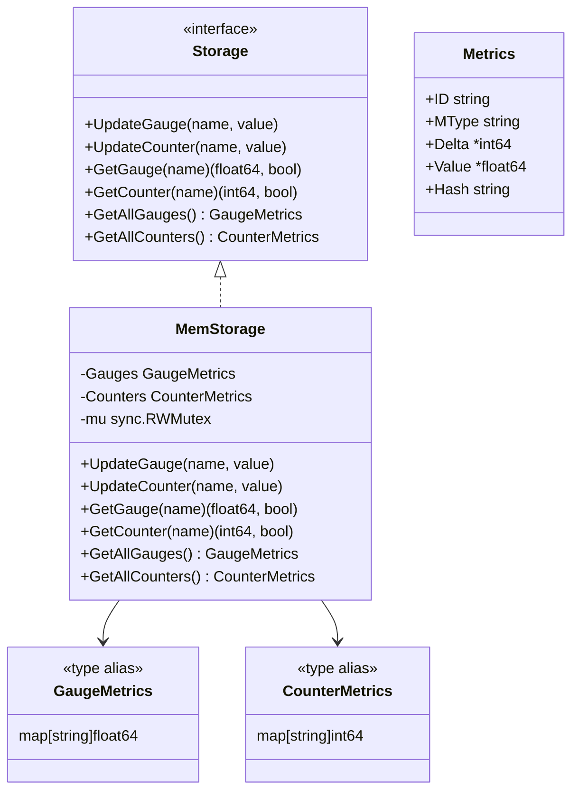

# internal/model

В этом пакете содержатся структуры данных, которые описывают основные сущности предметной области приложения.

Эти структуры используются в сервисах и хэндлерах. Данный пакет не должен содержать бизнес-логику приложения.

## Использование

```go
// Создание хранилища
storage := models.NewMemStorage()

// Обновление метрик
storage.UpdateGauge("temperature", 23.5)
storage.UpdateCounter("requests", 100)

// Получение метрик
value, exists := storage.GetGauge("temperature")
if exists {
    fmt.Printf("Temperature: %.2f\n", value)
}

// Получение всех метрик
allGauges := storage.GetAllGauges()
allCounters := storage.GetAllCounters()
```

## Структуры данных

### Архитектура моделей данных

```mermaid
graph TB
    subgraph "Data Models"
        GM[GaugeMetrics]
        CM[CounterMetrics]
        M[Metrics Struct]
    end
    
    subgraph "Storage Interface"
        SI[Storage Interface]
        MS[MemStorage]
        MUTEX[sync.RWMutex]
    end
    
    subgraph "Type Aliases"
        GAUGE[map[string]float64]
        COUNTER[map[string]int64]
    end
    
    GM --> GAUGE
    CM --> COUNTER
    MS --> GM
    MS --> CM
    MS --> MUTEX
    SI --> MS
    
    style GM fill:#e3f2fd
    style CM fill:#e3f2fd
    style M fill:#e3f2fd
    style SI fill:#e8f5e8
    style MS fill:#f3e5f5
    style MUTEX fill:#fff3e0
    style GAUGE fill:#e1f5fe
    style COUNTER fill:#e1f5fe
```

### Диаграмма классов



### Типы-алиасы

Для улучшения читаемости кода определены типы-алиасы:

```go
type GaugeMetrics map[string]float64
type CounterMetrics map[string]int64
```

### Storage Interface

Интерфейс для работы с хранилищем метрик:

```go
type Storage interface {
    UpdateGauge(name string, value float64)
    UpdateCounter(name string, value int64)
    GetGauge(name string) (float64, bool)
    GetCounter(name string) (int64, bool)
    GetAllGauges() GaugeMetrics
    GetAllCounters() CounterMetrics
}
```

### MemStorage

Реализация хранилища метрик в памяти:

```go
type MemStorage struct {
    Gauges   GaugeMetrics
    Counters CounterMetrics
    mu       sync.RWMutex // Мьютекс для потокобезопасности
}
```

**Особенности:**
- **Потокобезопасность** - все операции защищены RWMutex
- **Копирование данных** - GetAllGauges/GetAllCounters возвращают копии для безопасности
- **Производительность** - используется RWMutex для оптимизации чтения

### Metrics

Структура для представления метрики:

```go
type Metrics struct {
    ID    string   `json:"id"`
    MType string   `json:"type"`
    Delta *int64   `json:"delta,omitempty"`
    Value *float64 `json:"value,omitempty"`
    Hash  string   `json:"hash,omitempty"`
}
```
