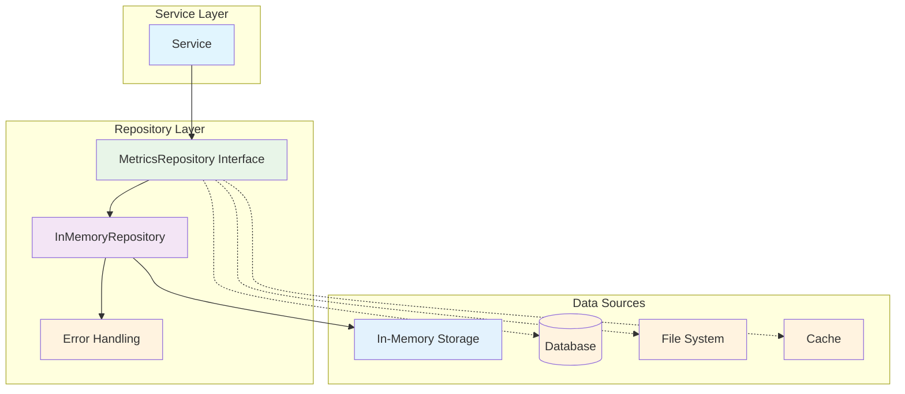
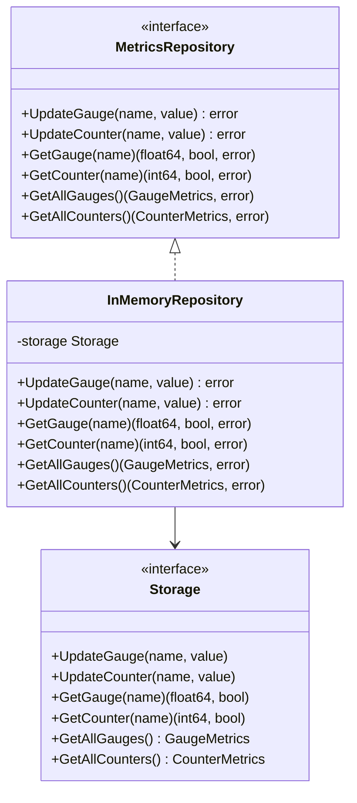

# internal/repository

Этот пакет содержит реализацию работы с базой данных, а также со внешними сервисами.

Важно, чтобы репозиторий не содержал бизнес-логику.

Репозиторий реализует паттерн Repository и служит абстракцией над различными источниками данных, такими как:
- базы данных (PostgreSQL, MySQL и др.)
- внешние API
- файловые системы
- кэши (Redis, Memcached)
- другие источники данных.

## Компоненты

### MetricsRepository

Интерфейс для работы с метриками:

```go
type MetricsRepository interface {
    UpdateGauge(name string, value float64) error
    UpdateCounter(name string, value int64) error
    GetGauge(name string) (float64, bool, error)
    GetCounter(name string) (int64, bool, error)
    GetAllGauges() (models.GaugeMetrics, error)
    GetAllCounters() (models.CounterMetrics, error)
}
```

### Архитектура репозитория



### Паттерн Repository



### InMemoryMetricsRepository

Реализация репозитория в памяти:

```go
type InMemoryMetricsRepository struct {
    storage models.Storage
}
```

## Использование

```go
// Создание репозитория
storage := models.NewMemStorage()
repo := repository.NewInMemoryMetricsRepository(storage)

// Обновление метрик
err := repo.UpdateGauge("temperature", 23.5)
err = repo.UpdateCounter("requests", 100)

// Получение метрик
value, exists, err := repo.GetGauge("temperature")
value, exists, err := repo.GetCounter("requests")

// Получение всех метрик
gauges, err := repo.GetAllGauges()
counters, err := repo.GetAllCounters()
```

## Преимущества

1. **Абстракция** - скрывает детали работы с источниками данных
2. **Тестируемость** - легко создавать моки для тестирования
3. **Гибкость** - можно легко заменить реализацию
4. **Обработка ошибок** - все методы возвращают ошибки
5. **Разделение ответственности** - репозиторий не содержит бизнес-логику

## Тестирование

```bash
go test -v ./internal/repository
```
