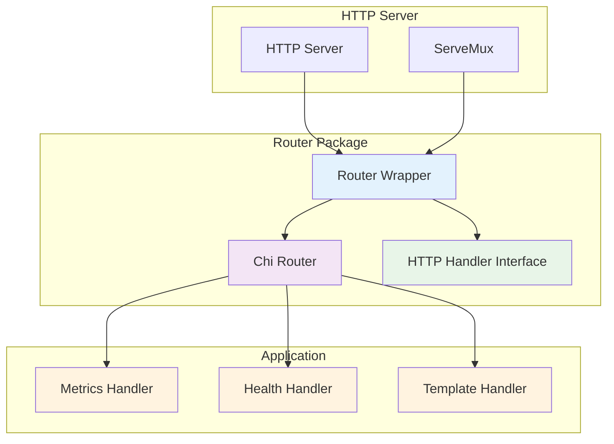
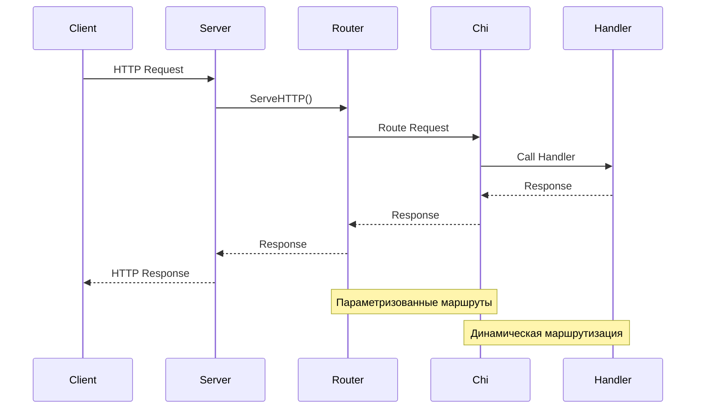

# Router Package

HTTP роутер-обертка над `github.com/go-chi/chi/v5`.

## Описание

Пакет `router` предоставляет простую обертку над `chi` роутером, которая:
- Упрощает регистрацию маршрутов
- Обеспечивает совместимость с `http.Handler`
- Позволяет легко расширять функциональность в будущем
- Сохраняет производительность и возможности `chi` роутера
- Поддерживает параметризованные маршруты

### Архитектура роутера



### Поток маршрутизации



## Использование

```go
// Создание роутера
r := router.New()

// Регистрация обработчиков
r.HandleFunc("/update/", metricsHandler.UpdateMetric)
r.Handle("/health", healthHandler)

// Использование в HTTP сервере
http.ListenAndServe(":8080", r)
```

## API

### New() *Router

Создает новый экземпляр роутера с chi роутером внутри.

### HandleFunc(pattern string, handler func(http.ResponseWriter, *http.Request))

Регистрирует функцию-обработчик для указанного пути.

### Handle(pattern string, handler http.Handler)

Регистрирует обработчик для указанного пути.

### ServeHTTP(w http.ResponseWriter, req *http.Request)

Реализует интерфейс `http.Handler`.

### GetRouter() *chi.Mux

Возвращает внутренний chi роутер для расширенной настройки маршрутов.


## Параметризованные маршруты

Роутер поддерживает параметризованные маршруты chi:

```go
// В httpserver настраиваем маршруты
chiRouter := r.GetRouter()
chiRouter.Get("/", handler.GetAllMetrics)
chiRouter.Post("/update/{type}/{name}/{value}", handler.UpdateMetric)
chiRouter.Get("/value/{type}/{name}", handler.GetMetricValue)

// В хендлерах получаем параметры
metricType := chi.URLParam(r, "type")
metricName := chi.URLParam(r, "name")
metricValue := chi.URLParam(r, "value")
```

## Преимущества

1. **Простота**: Легкий и понятный API
2. **Совместимость**: Полная совместимость с `http.Handler`
3. **Производительность**: Высокая производительность chi роутера
4. **Расширяемость**: Легко добавить middleware и другие функции
5. **Параметризованные маршруты**: Поддержка URL параметров
6. **Тестируемость**: Удобно для unit-тестирования

## Зависимости

- `github.com/go-chi/chi/v5` - HTTP роутер

## Тестирование

```bash
go test -v ./internal/router
``` 