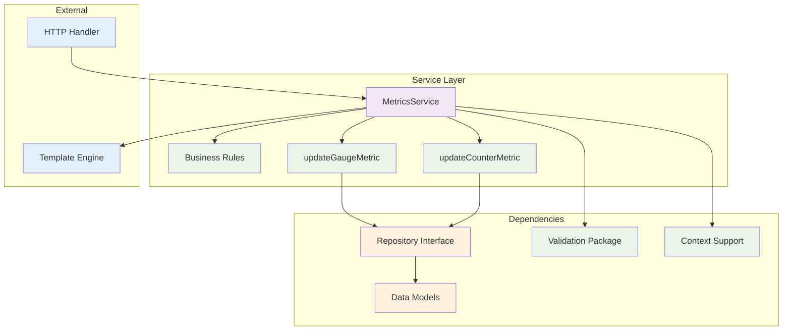
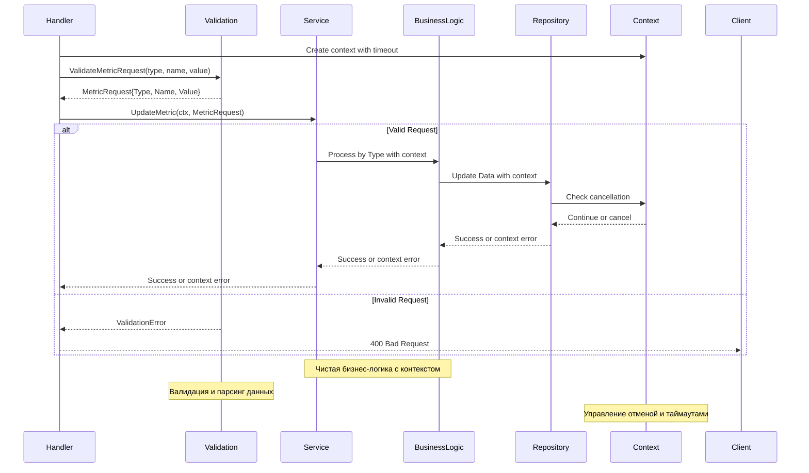

# internal/service

Пакет `service` содержит бизнес-логику и играет ключевую роль в реализации функциональности приложения.

В нём описаны правила, процессы и операции, которые определяют поведение приложения.

Принципы организации:
- Сервисы должны быть независимы от деталей транспорта (HTTP, gRPC и т.д.).
- Взаимодействие с данными происходит через интерфейсы репозиториев.
- Каждый сервис должен иметь четко определенную область ответственности.
- Сервисы работают с валидированными данными из пакета `validation`.
- Все операции поддерживают контекст для отмены и таймаутов.

## Компоненты

### MetricsService

Сервис для работы с метриками с поддержкой контекста:

```go
type MetricsService struct {
    repository repository.MetricsRepository
}
```

### Архитектура сервисного слоя



### Поток бизнес-логики с контекстом



## Основные методы

### UpdateMetric
Обновляет метрику с валидированными данными и контекстом:
```go
func (s *MetricsService) UpdateMetric(ctx context.Context, req *validation.MetricRequest) error
```

**Особенности:**
- Принимает готовые валидированные данные из пакета `validation`
- Поддерживает контекст для отмены операций и таймаутов
- Содержит только бизнес-логику без валидации
- Делегирует обновление в соответствующие методы по типу метрики

### updateGaugeMetric / updateCounterMetric
Приватные методы для обновления конкретных типов метрик с контекстом:
```go
func (s *MetricsService) updateGaugeMetric(ctx context.Context, name string, value float64) error
func (s *MetricsService) updateCounterMetric(ctx context.Context, name string, value int64) error
```

**Бизнес-логика:**
- Проверка лимитов и бизнес-правил
- Агрегация данных
- Уведомления при превышении порогов
- Аудит операций
- Поддержка отмены через контекст

### GetGauge/GetCounter
Получает значение метрики с контекстом:
```go
func (s *MetricsService) GetGauge(ctx context.Context, name string) (float64, bool, error)
func (s *MetricsService) GetCounter(ctx context.Context, name string) (int64, bool, error)
```

### GetAllGauges/GetAllCounters
Получает все метрики с контекстом:
```go
func (s *MetricsService) GetAllGauges(ctx context.Context) (models.GaugeMetrics, error)
func (s *MetricsService) GetAllCounters(ctx context.Context) (models.CounterMetrics, error)
```

## Использование

### С валидацией и контекстом (рекомендуемый способ)
```go
// Создание сервиса
repo := repository.NewInMemoryMetricsRepository()
service := service.NewMetricsService(repo)

// Создание контекста с таймаутом
ctx, cancel := context.WithTimeout(context.Background(), 10*time.Second)
defer cancel()

// Валидация и обновление метрик
metricReq, err := validation.ValidateMetricRequest("gauge", "temperature", "23.5")
if err != nil {
    return err
}
err = service.UpdateMetric(ctx, metricReq)

metricReq, err = validation.ValidateMetricRequest("counter", "requests", "100")
if err != nil {
    return err
}
err = service.UpdateMetric(ctx, metricReq)

// Получение метрик с контекстом
value, exists, err := service.GetGauge(ctx, "temperature")
value, exists, err := service.GetCounter(ctx, "requests")

// Получение всех метрик с контекстом
gauges, err := service.GetAllGauges(ctx)
counters, err := service.GetAllCounters(ctx)
```

### Работа с таймаутами и отменой
```go
// Создание контекста с таймаутом
ctx, cancel := context.WithTimeout(context.Background(), 5*time.Second)
defer cancel()

// Обновление метрики с таймаутом
err := service.UpdateMetric(ctx, metricReq)
if err != nil {
    switch err {
    case context.DeadlineExceeded:
        log.Println("Operation timed out")
    case context.Canceled:
        log.Println("Operation was canceled")
    default:
        log.Printf("Other error: %v", err)
    }
}
```

### В HTTP обработчике с контекстом
```go
func (h *MetricsHandler) UpdateMetric(w http.ResponseWriter, r *http.Request) {
    metricType := chi.URLParam(r, "type")
    metricName := chi.URLParam(r, "name")
    metricValue := chi.URLParam(r, "value")

    // Валидация через пакет validation
    metricReq, err := validation.ValidateMetricRequest(metricType, metricName, metricValue)
    if err != nil {
        http.Error(w, err.Error(), http.StatusBadRequest)
        return
    }

    // Создание контекста с таймаутом
    ctx, cancel := context.WithTimeout(r.Context(), 5*time.Second)
    defer cancel()

    // Вызов сервиса с валидированными данными и контекстом
    err = h.service.UpdateMetric(ctx, metricReq)
    if err != nil {
        if err == context.DeadlineExceeded {
            http.Error(w, "Request timeout", http.StatusRequestTimeout)
        } else if err == context.Canceled {
            http.Error(w, "Request canceled", http.StatusRequestTimeout)
        } else {
            http.Error(w, "Internal server error", http.StatusInternalServerError)
        }
        return
    }

    w.WriteHeader(http.StatusOK)
}
```

### Graceful Shutdown
```go
func gracefulShutdown(service *service.MetricsService) {
    // Создаем контекст для graceful shutdown
    ctx, cancel := context.WithTimeout(context.Background(), 30*time.Second)
    defer cancel()
    
    // Выполняем финальные операции
    gauges, err := service.GetAllGauges(ctx)
    if err != nil {
        log.Printf("Error getting final gauges: %v", err)
        return
    }
    
    // Сохраняем данные или выполняем cleanup
    log.Printf("Final gauges: %v", gauges)
}
```

## Преимущества новой архитектуры

1. **Разделение ответственности** - валидация вынесена в отдельный пакет
2. **Чистая бизнес-логика** - сервис работает только с валидированными данными
3. **Типобезопасность** - использование типизированных структур `MetricRequest`
4. **Поддержка контекста** - отмена операций, таймауты, graceful shutdown
5. **Тестируемость** - легко тестировать с моками репозитория и валидации
6. **Независимость** - не зависит от конкретных реализаций транспорта
7. **Расширяемость** - легко добавлять новую бизнес-логику
8. **Надежность** - правильная обработка отмены операций

## Тестирование

```bash
go test -v ./internal/service
```

### Тестирование с контекстом

```go
func TestServiceWithContext(t *testing.T) {
    repo := repository.NewInMemoryMetricsRepository()
    service := service.NewMetricsService(repo)
    
    ctx := context.Background()
    
    // Тест с обычным контекстом
    metricReq, _ := validation.ValidateMetricRequest("gauge", "test", "23.5")
    err := service.UpdateMetric(ctx, metricReq)
    assert.NoError(t, err)
    
    // Тест с отмененным контекстом
    ctx, cancel := context.WithCancel(context.Background())
    cancel()
    
    err = service.UpdateMetric(ctx, metricReq)
    assert.Equal(t, context.Canceled, err)
}
```
