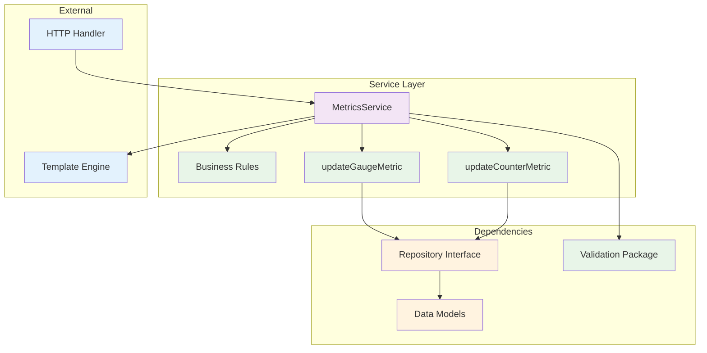
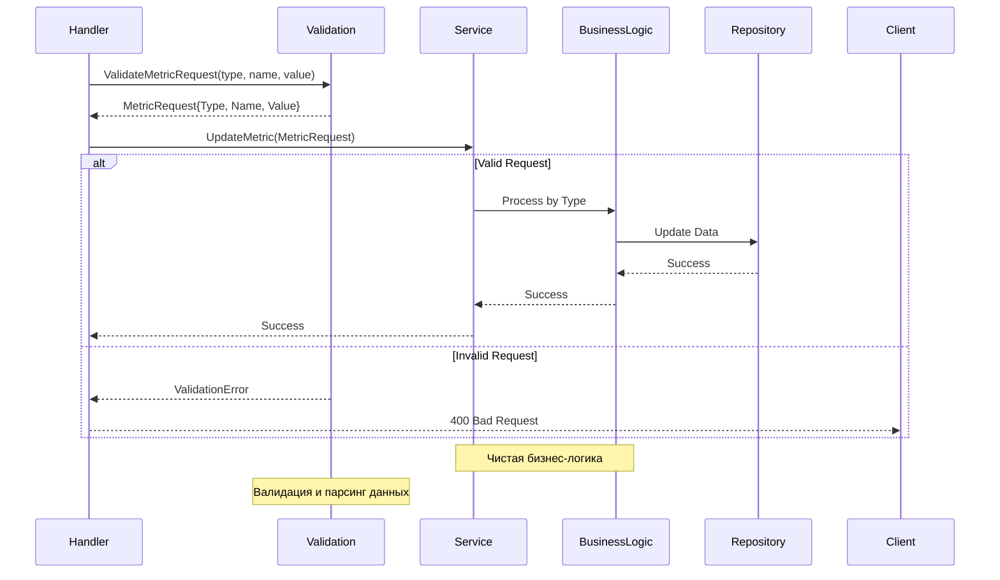

# internal/service

Пакет `service` содержит бизнес-логику и играет ключевую роль в реализации функциональности приложения.

В нём описаны правила, процессы и операции, которые определяют поведение приложения.

Принципы организации:
- Сервисы должны быть независимы от деталей транспорта (HTTP, gRPC и т.д.).
- Взаимодействие с данными происходит через интерфейсы репозиториев.
- Каждый сервис должен иметь четко определенную область ответственности.
- Сервисы работают с валидированными данными из пакета `validation`.

## Компоненты

### MetricsService

Сервис для работы с метриками:

```go
type MetricsService struct {
    repo repository.MetricsRepository
}
```

### Архитектура сервисного слоя



### Поток бизнес-логики



## Основные методы

### UpdateMetric
Обновляет метрику с валидированными данными:
```go
func (s *MetricsService) UpdateMetric(req *validation.MetricRequest) error
```

**Особенности:**
- Принимает готовые валидированные данные из пакета `validation`
- Содержит только бизнес-логику без валидации
- Делегирует обновление в соответствующие методы по типу метрики

### updateGaugeMetric / updateCounterMetric
Приватные методы для обновления конкретных типов метрик:
```go
func (s *MetricsService) updateGaugeMetric(name string, value float64) error
func (s *MetricsService) updateCounterMetric(name string, value int64) error
```

**Бизнес-логика:**
- Проверка лимитов и бизнес-правил
- Агрегация данных
- Уведомления при превышении порогов
- Аудит операций

### GetGauge/GetCounter
Получает значение метрики:
```go
func (s *MetricsService) GetGauge(name string) (float64, bool, error)
func (s *MetricsService) GetCounter(name string) (int64, bool, error)
```

### GetAllGauges/GetAllCounters
Получает все метрики:
```go
func (s *MetricsService) GetAllGauges() (models.GaugeMetrics, error)
func (s *MetricsService) GetAllCounters() (models.CounterMetrics, error)
```

## Использование

### С валидацией (рекомендуемый способ)
```go
// Создание сервиса
storage := models.NewMemStorage()
repo := repository.NewInMemoryMetricsRepository(storage)
service := service.NewMetricsService(repo)

// Валидация и обновление метрик
metricReq, err := validation.ValidateMetricRequest("gauge", "temperature", "23.5")
if err != nil {
    return err
}
err = service.UpdateMetric(metricReq)

metricReq, err = validation.ValidateMetricRequest("counter", "requests", "100")
if err != nil {
    return err
}
err = service.UpdateMetric(metricReq)

// Получение метрик
value, exists, err := service.GetGauge("temperature")
value, exists, err := service.GetCounter("requests")

// Получение всех метрик
gauges, err := service.GetAllGauges()
counters, err := service.GetAllCounters()
```

### В HTTP обработчике
```go
func (h *MetricsHandler) UpdateMetric(w http.ResponseWriter, r *http.Request) {
    metricType := chi.URLParam(r, "type")
    metricName := chi.URLParam(r, "name")
    metricValue := chi.URLParam(r, "value")

    // Валидация через пакет validation
    metricReq, err := validation.ValidateMetricRequest(metricType, metricName, metricValue)
    if err != nil {
        http.Error(w, err.Error(), http.StatusBadRequest)
        return
    }

    // Вызов сервиса с валидированными данными
    err = h.service.UpdateMetric(metricReq)
    if err != nil {
        http.Error(w, "Internal server error", http.StatusInternalServerError)
        return
    }

    w.WriteHeader(http.StatusOK)
}
```

## Преимущества новой архитектуры

1. **Разделение ответственности** - валидация вынесена в отдельный пакет
2. **Чистая бизнес-логика** - сервис работает только с валидированными данными
3. **Типобезопасность** - использование типизированных структур `MetricRequest`
4. **Тестируемость** - легко тестировать с моками репозитория и валидации
5. **Независимость** - не зависит от конкретных реализаций транспорта
6. **Расширяемость** - легко добавлять новую бизнес-логику

## Тестирование

```bash
go test -v ./internal/service
```
