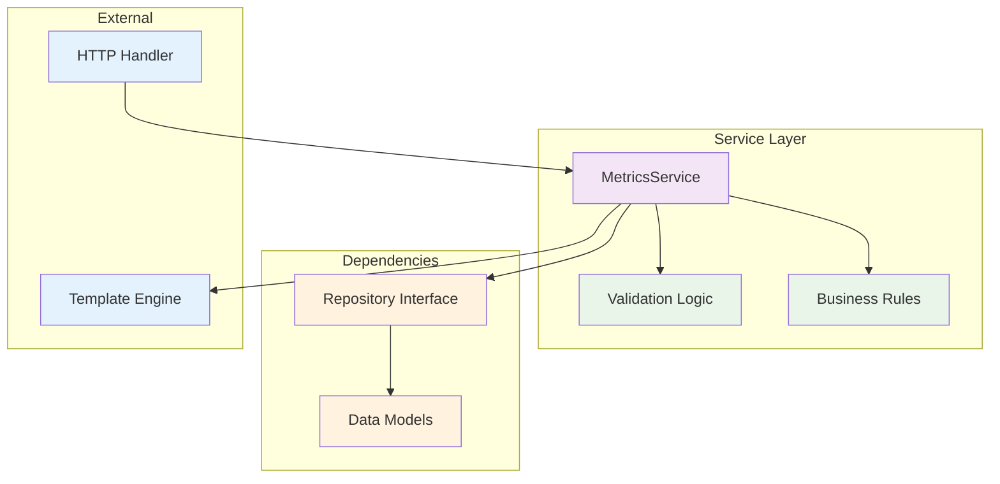
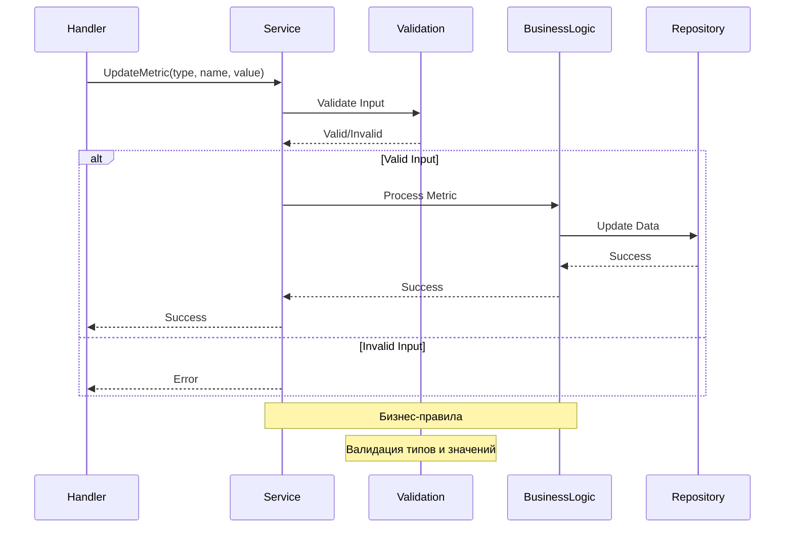

# internal/service

Пакет `service` содержит бизнес-логику и играет ключевую роль в реализации функциональности приложения.

В нём описаны правила, процессы и операции, которые определяют поведение приложения.

Принципы организации:
- Сервисы должны быть независимы от деталей транспорта (HTTP, gRPC и т.д.).
- Взаимодействие с данными происходит через интерфейсы репозиториев.
- Каждый сервис должен иметь четко определенную область ответственности.

## Компоненты

### MetricsService

Сервис для работы с метриками:

```go
type MetricsService struct {
    repo repository.MetricsRepository
}
```

### Архитектура сервисного слоя



### Поток бизнес-логики



## Основные методы

### UpdateMetric
Обновляет метрику по типу, имени и значению:
```go
func (s *MetricsService) UpdateMetric(metricType, name, value string) error
```

### GetGauge/GetCounter
Получает значение метрики:
```go
func (s *MetricsService) GetGauge(name string) (float64, bool, error)
func (s *MetricsService) GetCounter(name string) (int64, bool, error)
```

### GetAllGauges/GetAllCounters
Получает все метрики:
```go
func (s *MetricsService) GetAllGauges() (models.GaugeMetrics, error)
func (s *MetricsService) GetAllCounters() (models.CounterMetrics, error)
```

## Использование

```go
// Создание сервиса
storage := models.NewMemStorage()
repo := repository.NewInMemoryMetricsRepository(storage)
service := service.NewMetricsService(repo)

// Обновление метрик
err := service.UpdateMetric("gauge", "temperature", "23.5")
err = service.UpdateMetric("counter", "requests", "100")

// Получение метрик
value, exists, err := service.GetGauge("temperature")
value, exists, err := service.GetCounter("requests")

// Получение всех метрик
gauges, err := service.GetAllGauges()
counters, err := service.GetAllCounters()
```

## Преимущества

1. **Разделение ответственности** - бизнес-логика отделена от транспорта и данных
2. **Тестируемость** - легко тестировать с моками репозитория
3. **Независимость** - не зависит от конкретных реализаций
4. **Обработка ошибок** - все методы возвращают ошибки
5. **Валидация** - проверяет корректность входных данных

## Тестирование

```bash
go test -v ./internal/service
```
