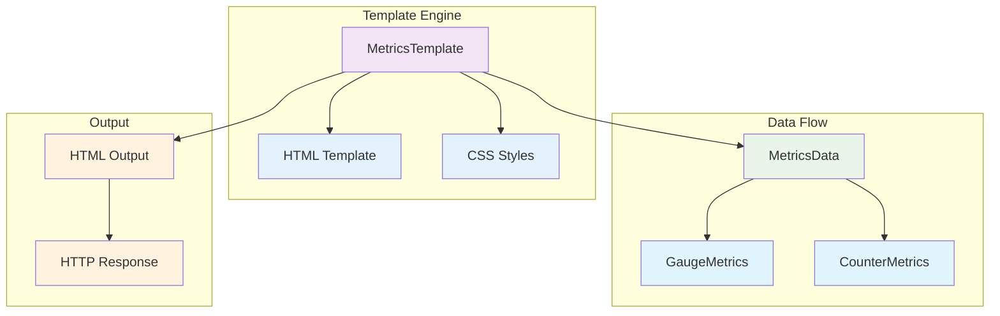
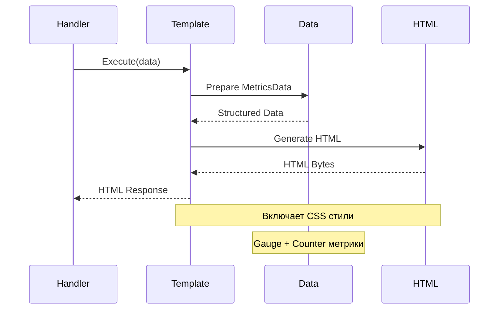

# Template Package

Пакет для работы с HTML шаблонами метрик.

## Описание

Пакет `template` предоставляет функциональность для генерации HTML страниц с отображением метрик. Основная цель - отделить логику формирования HTML от HTTP обработчиков.

## Компоненты

### MetricsData

Структура данных для передачи метрик в шаблон:

```go
type MetricsData struct {
    Gauges       models.GaugeMetrics  // Gauge метрики
    Counters     models.CounterMetrics // Counter метрики
    GaugeCount   int                  // Количество gauge метрик
    CounterCount int                  // Количество counter метрик
}
```

### Архитектура шаблонов



### Поток генерации HTML



### MetricsTemplate

Основной класс для работы с HTML шаблонами:

```go
type MetricsTemplate struct {
    template *template.Template
}
```

## Использование

```go
// Создание шаблона
mt, err := template.NewMetricsTemplate()
if err != nil {
    log.Fatal(err)
}

// Подготовка данных
data := template.MetricsData{
    Gauges: models.GaugeMetrics{
        "temperature": 23.5,
        "memory":      1024.0,
    },
    Counters: models.CounterMetrics{
        "requests": 100,
        "errors":   5,
    },
    GaugeCount:   2,
    CounterCount: 2,
}

// Генерация HTML
htmlBytes, err := mt.Execute(data)
if err != nil {
    log.Fatal(err)
}

// Отправка в HTTP ответ
w.Header().Set("Content-Type", "text/html; charset=utf-8")
w.Write(htmlBytes)
```

## HTML Шаблон

Шаблон включает:
- Современный CSS дизайн
- Отдельные секции для gauge и counter метрик
- Счетчики метрик
- Сообщения при отсутствии метрик
- Адаптивную верстку

## Преимущества

1. **Разделение ответственности** - HTML логика отделена от HTTP обработчиков
2. **Переиспользование** - шаблон можно использовать в разных частях приложения
3. **Тестируемость** - легко тестировать генерацию HTML
4. **Поддержка** - простое изменение дизайна и структуры
5. **Производительность** - шаблон парсится один раз при создании

## Тестирование

```bash
go test -v ./internal/template
```
